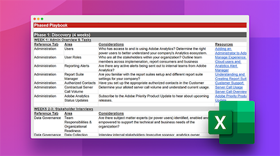

# Übernahme einer bestehenden Adobe Analytics-Implementierung

Übernehmen Sie eine Adobe Analytics-Implementierung vom vorherigen technisch Verantwortlichen? Unser Playbook für geerbte Implementierungen hilft Ihnen, die Verantwortung als neuer technisch Verantwortlicher einer bestehenden Implementierung zu übernehmen. In der herunterladbaren Tabelle führen wir Sie durch die Erkundungs-, Audit- und Dokumentationsaktivitäten, die Sie in den ersten 10 Wochen Ihrer Tätigkeit durchführen sollten, wenn Sie eine bestehende Implementierung übernehmen.

**Das [Playbook für geerbte Implementierungen](assets/adobe_analytics_inherited_implementation_playbook.xlsx) herunterladen.**

Sehen Sie sich diese Tipps von Sarah Owen an, ebenfalls eine technisch Verantwortliche. Sarah ist eine Adobe Analytics-Expertin und sie teilt mit uns ihre Ideen dazu, wie wir das inherited implementation Playbook zur Übernahme einer bestehenden Implementierung nutzen können:

>[!BEGINSHADEBOX]

Siehe  [Verwenden des übernommenen Implementierungs-](https://video.tv.adobe.com/v/3438773?captions=ger&quality=12&learn=on){target="_blank"}) für ein Demovideo.

>[!ENDSHADEBOX]

Siehe auch:

* [Checkliste „Gezielte Überprüfung“ zur Überprüfung Ihrer Implementierung nach jeder Website-Veröffentlichung](/help/implement/review/focused-review.md)
* [Checkliste „Vollständige Prüfung“ Ihrer Implementierung alle 6 Monate](/help/implement/review/full-review.md)
* [Definieren Ihrer fünf wichtigsten KPIs](/help/implement/review/define-kpis.md)
