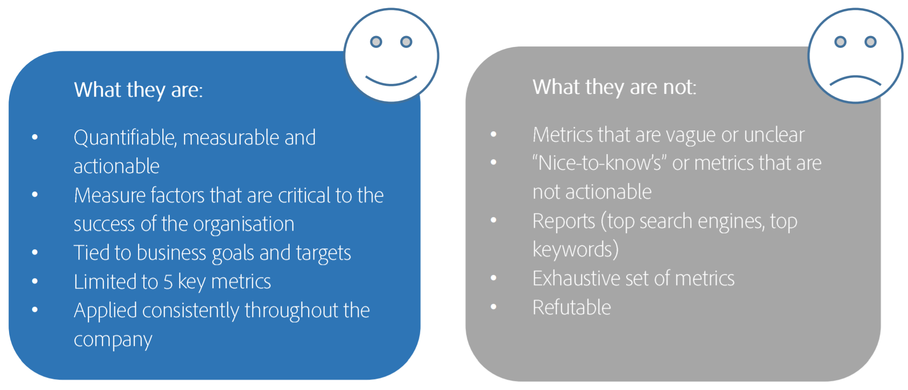

# Definieren Ihrer fünf wichtigsten KPIs

Sie können einfach nicht alles messen, und Ihre Adobe Analytics-Implementierung ist am erfolgreichsten, wenn Sie vor allem das messen, was für das Unternehmen am wichtigsten ist. Arbeiten Sie mit Ihren Geschäftsführern zusammen, um die wichtigsten Leistungsindikatoren (KPIs) zu definieren, die für Ihr Unternehmen die größte Wirkung haben. Konzentrieren Sie Ihre Bemühungen dann auf die Metriken und Variablen, die diese KPIs unterstützen.

## &#x200B;1. Ihre Geschäftsziele verstehen

Beginnen Sie damit, dass Sie zunächst einmal Ihre Geschäftsziele verstehen, sodass Sie die 5 KPIs wählen können, die für das Unternehmen am wichtigsten sind. Bei diesen KPIs kann es sich um Kennzahlen wie den Umsatz oder um berechnete Kennzahlen wie den Umsatz pro Besuch handeln. Die Kennzahlen können auch Variablen enthalten. Kopieren Sie KEINE zufälligen KPIs von anderen Unternehmen oder aus Branchenstandards - sie passen wahrscheinlich nicht zu IHREN Geschäftszielen.

## &#x200B;2. Stellen Sie die entscheidende Frage

Fragen Sie sich Folgendes: Wenn Ihre CEO auf einer Insel festsitzen würde und Sie ihr nur 5 Dinge über den Status des Unternehmen erzählen könnten, was wären diese Dinge? Wenn du ihr sagtest, dass die durchschnittliche Besuchszeit auf einer Seite 1:30 beträgt, würde ihr das überhaupt nicht helfen. Wenn Sie ihr jedoch mitteilen, dass Ihr durchschnittlicher Umsatz pro Besuch 2,00 USD betrug und Ihre Seite 2 Millionen Mal besucht wurde, hat sie dadurch wirklich eine Vorstellung vom geschäftlichen Erfolg.

## &#x200B;3. Denken Sie daran, was KPIs sind und was sie nicht sind

## &#x200B;4. Definieren der KPIs

Füllen Sie Ihr eigenes Diagramm aus, das ähnlich wie das folgende aussieht:

| Geschäftsziel | Metriken und Dimensionen |
| --- | --- |
| Umsatzsteigerung durch digitale Kanäle | Umsatz pro Besuch |
| Steigern der Markenwahrnehmung | Besucher |
| Fördern von vertieften und dauerhaften Kundenbeziehungen | Anmeldungen, Klicks |
| Site-Konversionswerte | CTA-Klicks/Gesamte Ansichten |
| Site-Interaktion | Seitenansichten pro Unique Visitor, Besuchszeit auf der Site bei durchschnittlichen Besuchern |

## &#x200B;5. Überprüfen Sie Ihre KPIs regelmäßig

Aktualisieren Sie Ihre KPIs mindestens alle 6 Monate – vergessen Sie nicht, dass sich die Bedürfnisse des Unternehmens häufig ändern!
