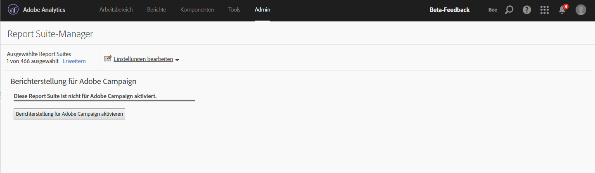

# Adobe Campaign Standard-Berichte

Weitere Informationen zum Konfigurieren dieser Integrationen finden Sie in der [Adobe Campaign-Dokumentation](https://helpx.adobe.com/de/campaign/standard/integrating/using/about-campaign-analytics-integration.html).

>[!IMPORTANT]
>Dieser Artikel gilt nur für die Adobe Campaign **Standard**-Berichte. Weitere Informationen zum Hinzufügen von Adobe Campaign **Classic**-Berichten finden Sie [hier](/help/integrate/analytics-to-campaign-classic.md).

Mithilfe dieser Integration zwischen Adobe Analytics und Adobe Campaign Standard:

* Ermöglicht die Freigabe Ihrer KPI-Daten (Key Performance Indicator) von Adobe Campaign Standard an Adobe Analytics.
* Reichert Tracking-Formeln mit Adobe Analytics-Parametern an.
* wird unter **[!UICONTROL Analytics]** > **[!UICONTROL Berichte]** > **[!UICONTROL Adobe Campaign]** ein neuer Bericht hinzugefügt.
* werden 5 neue Adobe Campaign-Klassifizierungen hinzugefügt.
* werden 9 neue Adobe Campaign-Metriken hinzugefügt.
* werden 6 neue Adobe Campaign-Dimensionen hinzugefügt.
* Synchronisiert Daten alle 15 Minuten mit Analytics über eine automatisch bereitgestellte Datenquelle.

## Schritt 1. Aktivieren von Adobe Campaign Standard-Berichten {#section_C685EF10505045708A6536BB13F6CD58}

Wenn Sie Campaign Standard-Daten in Analytics anzeigen möchten, müssen Sie zunächst Campaign-Berichte im Report Suite Manager aktivieren.

1. Navigieren Sie zu **[!UICONTROL Analytics]** > **[!UICONTROL Admin]** > **[!UICONTROL Report Suites]** > **`<select report suite>`** > **[!UICONTROL Einstellungen bearbeiten]** > **[!UICONTROL Adobe Campaign]** > **[!UICONTROL Berichterstellung für Adobe Campaign]** .
1. Klicken Sie auf **[!UICONTROL Berichterstellung für Campaign aktivieren]**.

   

## Schritt 2. Anzeigen von Adobe Campaign-Berichten {#section_9C18A29F3CC54BD4AC5EA96417F17B33}

Durch die Integration zwischen Adobe Campaign Standard und Adobe Analytics wird der folgende Bericht unter **[!UICONTROL Analytics]** > **[!UICONTROL Berichte]** hinzugefügt.

* **[!UICONTROL ID des von Adobe Campaign ausgeführten Versands]**: Zeigt aus Adobe Campaign importierte Daten zu E-Mails an, die von Adobe Campaign gesendet wurden. |

## Schritt 3. Verwenden von Klassifizierungen in Adobe Campaign {#section_74A28AF3F4CA4091943789DE4D8B2B63}

**[!UICONTROL Analytics]** > **[!UICONTROL Admin]** > **[!UICONTROL Report Suites]** > **`<select report suite>`** > **[!UICONTROL Einstellungen bearbeiten]** > **[!UICONTROL Adobe Campaign]** > **[!UICONTROL Adobe Campaign Classifications]**

Nach der Aktivierung Ihrer Report Suite für Adobe Campaign sind die folgenden Klassifizierungen verfügbar:

| Klassifizierung | Beschreibung |
| --- | --- |
| [!UICONTROL Versand-ID] | in Campaign angezeigter, interner Versandname |
| [!UICONTROL Versandbezeichnung] | Versand in Campaign – Individueller Versand/Periodischer Versand/Transaktionsversand |
| [!UICONTROL Kampagnen-ID] | Interner Kampagnenname, der in Campaign angezeigt wird |
| [!UICONTROL Kampagnenbezeichnung] | Campaign in Adobe Campaign |
| [!UICONTROL Bezeichnung des ausgeführten Versands] | Liste der jeweils ausgeführten Sendungen |

## In Adobe Analytics verfügbare Adobe Campaign Standard-Dimensionen und -Metriken {#section_F33385C9660644AF84172EC39601469B}

Die folgenden **Metriken** sind in Campaign in Adobe Analytics Report Suites verfügbar:

* Adobe Campaign gesendet
* Adobe Campaign geöffnet
* Adobe Campaign angeklickt
* Adobe Campaign bereitgestellt
* Eindeutige Adobe Campaign-Öffnungen
* Eindeutiger Adobe Campaign-Klick
* Adobe Campaign abgemeldet
* Adobe Campaign - Bounces insgesamt
* Von Adobe Campaign ausgeführte Versand-ID-Instanzen

Die folgenden **Dimensionen** sind in Campaign in Adobe Analytics Report Suites verfügbar:

| Dimension-Name | Definition |
| --- | --- |
| Kampagnen-ID | ID aller Kampagnen, für die während der Dauer KPIs gesendet wurden. |
| Kampagnen-Label | Kennzeichnungen der Kampagnen-IDs |
| Versand-ID | Kennung aller Sendungen, für die während der Dauer KPIs versendet wurden. Enthält auch IDs von Master-Sendungen des wiederkehrenden Versands und des Transaktionsversands. Beispiel: Eine periodische Bereitstellung DM1 wurde geplant und DM2, DM3, DM4 und DM5 waren untergeordnete Bereitstellungen der periodischen Bereitstellung.  Die Versand-ID zeigt die Ergebnisse für alle Sendungen DM1 bis DM5 an. |
| Versandtitel | Titel der Versand-IDs |
| ID der ausgeführten Bereitstellung | IDs nur der ausgeführten Sendungen. Keine Kennung des wiederkehrenden/transaktionalen Master-Versands. Beispiel: Eine periodische Bereitstellung DM1 wurde geplant und DM2, DM3, DM4 und DM5 waren untergeordnete Bereitstellungen der periodischen Bereitstellung. Die ID Ausgeführter Versand zeigt die Ergebnisse für alle Sendungen an, die von DM2 bis DM5 beginnen - die Sendungen, die tatsächlich ausgeführt wurden. |
| Titel des ausgeführten Versands | Kennzeichnungen der ausgeführten Versand-IDs |
