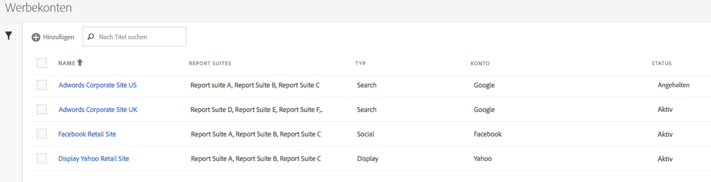

# Werbekonto einrichten

Adobe Analytics-Administratoren können neue Werbekonten erstellen und mehrere Konten mehreren Report Suites (1 : 1, 1 : Viele, Viele : Viele) zuordnen.

Administratoren können auch [Nicht-Administratoren Zugriff gewähren](/help/integrate/c-advertising-analytics/overview.md#section_FCC58EB635954A32990D4E67B52B4369), damit sie Werbekonten einrichten können.

<!--

-->

1. Navigieren Sie in Adobe Analytics zu **[!UICONTROL Admin]** > **[!UICONTROL Werbekonten]**.
1. (Nur bei erster Verwendung) Akzeptieren Sie die Bedingungen der Endnutzer-Lizenzvereinbarung.
1. Wählen Sie **[!UICONTROL + Hinzufügen]**.
1. Das [!UICONTROL Neue Suchmaschineneinstellung] wird angezeigt.

   

1. Füllen Sie die **[!UICONTROL Suchmaschineneinstellungen]** gemäß den folgenden Richtlinien aus:

   | Einstellung | Beschreibung |
   | --- | --- |
   | **[!UICONTROL Typ]** | Sie haben zwei Optionen: **[!UICONTROL Google AdWords]** und **[!UICONTROL Bing Ads]**.  Hinweis: Yahoo Gemini wurde am 31. März 2019 von Microsoft Bing übernommen. Daher ist die Anzeigen-Kontenoption „Yahoo Gemini“ nicht mehr verfügbar. |
   | Kontoname | Sie können diesen Kontonamen auf einen beliebigen, für Sie passenden Namen festlegen.  Kontoname ist der Anzeigename des Kontos, der in der Benutzeroberfläche angezeigt wird. |
   | OAuth-Token | **Hinweis**: Bei OAuth handelt es sich um einen offenen Zugriffsstandard, der häufig eingesetzt wird, um Websites oder Anwendungen Zugriff auf Informationen auf Websites zu gewähren, ohne dabei Passwörter anzugeben. Sie werden an eine Drittanbieter-URL (efrontier.com) weitergeleitet. Adobe verwendet Adobe Media Optimizer, um den OAuth-Authentifizierungsprozess für alle drei Suchmaschinen zu unterstützen. Wenn Sie Internet Explorer 11 (oder früher) verwenden, können Sie für keine der drei Suchmaschinen das OAuth-Token abrufen. Verwenden Sie stattdessen einen anderen Webbrowser.
Wählen Sie **[!UICONTROL Token abrufen]** aus, um den OAuth2-Authentifizierungsprozess zu starten. Sie werden aufgefordert, sich mit Ihren Anmeldedaten bei Ihrem Google-/Bing-Suchkonto anzumelden. Je nach Auswahl unterscheidet sich der Prozess geringfügig: <ul><li>Google AdWords: Geben Sie die Google-Konto-ID an</li><li>Microsoft Bing: Geben Sie die Bing-Konto-ID und die Bing-Kunden-ID an.</li></ul>Weitere Informationen [ diesen IDs finden Sie unter ](/help/integrate/c-advertising-analytics/c-adanalytics-workflow/aa-locate-account-id.md)Finden Ihrer Konto-ID“. Nachdem Sie sich erfolgreich angemeldet haben, wird im Feld **[!UICONTROL OAuth-Token]** **[!UICONTROL Abgerufen]** angezeigt. |

1. Im Abschnitt **[!UICONTROL Tracking]** geben Sie Informationen dazu an, wie Sie die Daten mithilfe Ihrer Adobe Analytics-Implementierung verfolgen können. Das Tracking ist ein erforderlicher Schritt, um die Adobe Analytics-Daten ordnungsgemäß mit den Suchmaschinendaten zu ergänzen.
Legen Sie die **[!UICONTROL Tracking-Einstellungen]** gemäß folgenden Richtlinien fest:

   | Einstellung | Beschreibung |
   | --- | --- |
   | Typ | <ul><li>**Auto**: Ermöglicht der Advertising Cloud-Engine zu entscheiden, wie die Tracking-Parameter an die Tracking-Vorlagen/Ziel-URLs des s angehängt werden. [!UICONTROL Automatisches Typ-Tracking] ist der einfachste Ansatz, führt jedoch möglicherweise nicht zum am besten integrierten Datensatz. **Wichtig** Um ein Suchmaschinenkonto mit &quot;[!UICONTROL -Tracking“ ] konfigurieren, sind Sie für die folgenden Aktionen verantwortlich:<ul><li>Der `s_kwcid` und der Wert werden zu den Konto-Tracking-Vorlagen oder Landingpage-URLs im hinzugefügten Konto hinzugefügt. Der Parameter und der Wert werden am Ende der URL eingefügt. Möglicherweise sind zusätzliche Aktionen erforderlich, wenn Ihr Webserver ein bestimmtes `key=value` am Ende der URL erfordert. Oder es ist eine Aktualisierung erforderlich, um jedes neue `key=value` in der URL zu unterstützen. **Hinweis**: Erfahren Sie mehr darüber, ob Sie diesen Parameter zu Ihrer [Content Security Policy“ hinzufügen ](https://experienceleague.adobe.com/en/docs/id-service/using/reference/csp).</li><li>Darüber hinaus können Keywords als Teil des Wertes `s_kwcid` in die Landingpage-URL eingefügt werden. Wenn die Schlüsselwörter Sonderzeichen oder Symbole enthalten, bestätigen Sie bitte, dass Ihr Webserver diese Zeichen unterstützen kann. Ein Beispiel für gängige Sonderzeichen ist `+`, das in Schlüsselwörtern vom Typ „Broad Match Modified“ verwendet wird.</li></ul></li><li>**Manuell**: Hiermit können Sie verwalten, wie die Tracking-Parameter zu den Tracking-Vorlagen/Ziel-URLs der Suchmaschine hinzugefügt werden. [Weitere Informationen finden Sie in den Beispielen für manuelles Tracking für die einzelnen Suchmaschinen](/help/integrate/c-advertising-analytics/c-adanalytics-workflow/aa-manual-vs-automatic-tracking.md).</li></ul> |

1. Im Abschnitt **[!UICONTROL Zuordnung]** wählen Sie eine oder mehrere Report Suites aus, die mit diesem Suchmaschinenkonto verknüpft werden sollen. Sie müssen mindestens eine Report Suite angeben, bevor Sie das Werbekonto speichern können. Sie können mehrere Konten mehreren Report Suites zuordnen (1 : 1, 1 : Viele, Viele : Viele). Beachten Sie, dass die Daten, die Adobe Media Optimizer aus der Suchmaschine abruft, einfach in jede zugeordnete Report Suite kopiert werden, sodass keine Aufspaltung der Daten erfolgt.

   >[!IMPORTANT]
   >
   >Nur Report Suites, die einer Experience Cloud-Organisation zugeordnet sind, können ausgewählt werden. Wenn Ihre Report Suite nicht aufgeführt ist, suchen Sie im Abschnitt [Problembehebung in Advertising Analytics](/help/integrate/c-advertising-analytics/c-adanalytics-workflow/aa-troubleshooting.md) nach weiteren Informationen.

   Legen Sie die **[!UICONTROL Zuordnungseinstellungen]** gemäß folgenden Richtlinien fest:

   | Einstellung | Beschreibung |
   | --- | --- |
   | Report-Suite-Zuordnung | Die Report-Suite-Zuordnung bestimmt die Report Suite, die mit diesem Suchmaschinenkonto verknüpft werden soll. Anders ausgedrückt: Sie bestimmt, an welche Report Suite(s) die Daten der Suchmaschine gesendet werden. |

1. Wählen Sie **[!UICONTROL Speichern]** aus.
1. Ein Haftungsausschluss zeigt eine Liste von Einschränkungen an. Bestätigen Sie, dass Sie diese Vereinbarung gelesen und verstanden haben. Aktivieren Sie das Kontrollkästchen und klicken Sie dann auf **[!UICONTROL OK]**.

   Nun wird die [Verwaltungsoberfläche](/help/integrate/c-advertising-analytics/c-adanalytics-workflow/aa-manage-ad-accounts.md) für Werbekonten angezeigt, in der das neu erstellte Konto aufgeführt sein sollte.

>[!NOTE]
>
>Es sollte mindestens 24 Stunden gewartet werden, bevor mit den Suchmaschinendaten die Befüllung Ihrer Analytics-Berichte beginnt.
