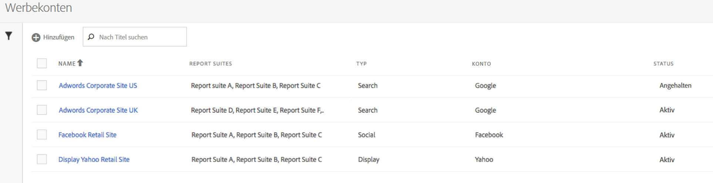

# Werbekonto einrichten

Adobe Analytics-Administratoren können neue Werbekonten erstellen und mehrere Konten mehreren Report Suites (1 : 1, 1 : Viele, Viele : Viele) zuordnen.

Admins können [ auch Benutzern ohne Administratorrechte Zugriff ](/help/integrate/c-advertising-analytics/overview.md#section_FCC58EB635954A32990D4E67B52B4369) die Einrichtung von Werbekonten gewähren.

<!--

-->

1. Navigieren Sie in Adobe Analytics zu **[!UICONTROL Admin]** > **[!UICONTROL Werbekonten]**.
1. (Nur Erstverwendung) Akzeptieren Sie die Bedingungen der Endbenutzer-Lizenzvereinbarung.
1. Wählen Sie **[!UICONTROL + Hinzufügen]**.
1. Das [!UICONTROL Neue Suchmaschineneinstellung] wird angezeigt.

   

1. Füllen Sie die **[!UICONTROL Suchmaschineneinstellungen]** gemäß den folgenden Richtlinien aus:

   | Einstellung | Beschreibung |
   | --- | --- |
   | **[!UICONTROL Typ]** | Sie haben zwei Optionen: **[!UICONTROL Google AdWords]** und **[!UICONTROL Bing Ads]**. Hinweis: Yahoo Gemini wurde am 31. März 2019 von Microsoft aufgenommen. Daher ist die Anzeigen-Kontenoption „Yahoo Gemini“ nicht mehr verfügbar. |
   | Kontoname | Sie können diesen Kontonamen auf einen beliebigen, für Sie passenden Namen festlegen.  Kontoname ist der Anzeigename des Kontos, der in der Benutzeroberfläche angezeigt wird. |
   | OAuth-Token | **Hinweis**: Bei OAuth handelt es sich um einen offenen Zugriffsstandard, der häufig eingesetzt wird, um Websites oder Anwendungen Zugriff auf Informationen auf Websites zu gewähren, ohne dabei Passwörter anzugeben. Sie werden an eine Drittanbieter-URL (efrontier.com) weitergeleitet. Adobe verwendet Adobe Media Optimizer, um den OAuth-Authentifizierungsprozess für alle drei Suchmaschinen zu optimieren. Wenn Sie Internet Explorer 11 (oder früher) verwenden, können Sie für keine der drei Suchmaschinen das OAuth-Token abrufen. Verwenden Sie stattdessen einen anderen Webbrowser.
Wählen Sie **[!UICONTROL Token abrufen]** aus, um den OAuth2-Authentifizierungsprozess zu starten. Sie werden aufgefordert, sich mit Ihren Anmeldedaten bei Ihrem Google Ads- oder Microsoft Advertising-Suchkonto anzumelden. Je nach Auswahl unterscheidet sich der Prozess geringfügig: <ul><li>Google Ads: Google-Konto-ID angeben</li><li>Microsoft Advertising: Geben Sie Ihre Konto-ID und Manager-Konto-ID an.</li></ul>Weitere Informationen [ diesen IDs finden Sie unter ](aa-locate-account-id.md)Finden Ihrer Konto-ID“. Nachdem Sie sich erfolgreich angemeldet haben, wird im Feld **[!UICONTROL OAuth-Token]** **[!UICONTROL Abgerufen]** angezeigt. |

1. Im Abschnitt **[!UICONTROL Tracking]** geben Sie Informationen dazu an, wie Sie die Daten mithilfe Ihrer Adobe Analytics-Implementierung verfolgen können. Das Tracking ist ein erforderlicher Schritt, um die Adobe Analytics-Daten ordnungsgemäß mit den Suchmaschinendaten zu ergänzen.
Füllen Sie die **[!UICONTROL Tracking-Einstellungen]** gemäß den folgenden Richtlinien aus:

   | Einstellung | Beschreibung |
   | --- | --- |
   | Typ | <ul><li>**Auto**: Ermöglicht der Adobe Advertising-Engine zu entscheiden, wie die Tracking-Parameter an die Tracking-Vorlagen/Ziel-URLs des s angehängt werden. [!UICONTROL Automatisches Typ-Tracking] ist der einfachste Ansatz, führt jedoch möglicherweise nicht zum am besten integrierten Datensatz. **Wichtig:** Um ein Suchmaschinenkonto mit [!UICONTROL Automatisches Typ-Tracking] zu konfigurieren, sind Sie für die folgenden Aktionen verantwortlich:<ul><li>Der `s_kwcid` und der Wert werden zu den Konto-Tracking-Vorlagen oder Landingpage-URLs im hinzugefügten Konto hinzugefügt. Der Parameter und der Wert werden am Ende der URL eingefügt. Möglicherweise sind zusätzliche Aktionen erforderlich, wenn Ihr Webserver ein bestimmtes `key=value` am Ende der URL erfordert. Oder es ist eine Aktualisierung erforderlich, um jedes neue `key=value` in der URL zu unterstützen. **Hinweis**: Erfahren Sie mehr darüber, ob Sie diesen Parameter zu Ihrer [Content Security Policy“ hinzufügen ](https://experienceleague.adobe.com/en/docs/id-service/using/reference/csp).</li><li>Darüber hinaus können Keywords als Teil des Wertes `s_kwcid` in die Landingpage-URL eingefügt werden. Wenn die Schlüsselwörter Sonderzeichen oder Symbole enthalten, bestätigen Sie bitte, dass Ihr Webserver diese Zeichen unterstützen kann. Ein Beispiel für gängige Sonderzeichen ist `+`, das in Schlüsselwörtern vom Typ „Broad Match Modified“ verwendet wird.</li></ul></li><li>**Manuell**: Hiermit können Sie verwalten, wie die Tracking-Parameter zu den Tracking-Vorlagen/Ziel-URLs der Suchmaschine hinzugefügt werden. [Weitere Informationen finden Sie in den Beispielen für manuelles Tracking für die einzelnen Suchmaschinen](/help/integrate/c-advertising-analytics/c-adanalytics-workflow/aa-manual-vs-automatic-tracking.md).</li></ul> |

1. Wählen Sie **[!UICONTROL Speichern]** aus.
1. Ein Haftungsausschluss zeigt eine Liste von Einschränkungen an. Bestätigen Sie, dass Sie diese Vereinbarung gelesen und verstanden haben. Aktivieren Sie das Kontrollkästchen und klicken Sie dann auf **[!UICONTROL OK]**.

   Sie gelangen nun zur Advertising-[ (Verwaltungs-Benutzeroberfläche](/help/integrate/c-advertising-analytics/c-adanalytics-workflow/aa-manage-ad-accounts.md), wo Ihr neu erstelltes Konto aufgeführt werden sollte.

>[!NOTE]
>
>Rechnen Sie mit einer Wartezeit von mindestens 24 Stunden, bevor die Suchmaschinendaten in Ihre Analytics-Berichte aufgenommen werden.
