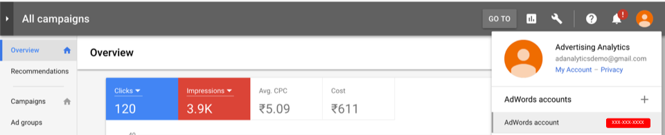

# Konto-IDs suchen

Im Folgenden finden Sie Anweisungen, mit denen Sie die Konto-IDs für Google oder Bing finden können.

## Google AdWords {#section_2A62AD448BD949889DB77C2AF3E04C33}

>[!IMPORTANT]
>
>Google AdWords verwendet zwei Kontotypen:
>
>- MCC-Konto (My Client Center) und
>- Standardkonto.
>
>Für diese Integration mit Adobe Analytics: **Sie müssen die Standardkonto-Anmeldung verwenden**, keine MCC-Kontoanmeldung. Das liegt daran, dass das MCC-Konto als übergeordnetes Konto dient, das mit einem einzelnen Login auf verschiedene AdWords-Konten zugreifen kann. Die Standardkonto-Anmeldung kann hingegen pro Login nur auf ein AdWords-Konto zugreifen. Während Google die Verknüpfung einer E-Mail-Adresse mit bis zu 5 Konten ermöglicht, unterstützt Advertising Analytics diese Funktion noch nicht. Eine E-Mail-Adresse kann nur mit einem Adwords-Konto verknüpft werden.

Klicken Sie oben rechts auf das Kontosymbol, um die AdWords-Kontonummer (Kunden-ID) anzuzeigen.

## Bing {#section_F1B9C7E997444746936599732CD62665}

>[!NOTE]
>
>Wenn Ihr Bing-Konto die Google-Importfunktion verwendet, müssen Sie die richtige Tracking-Zeichenfolge aktualisieren. Die Tracking-Zeichenfolge wird nicht automatisch von der Google-Version auf die richtige Bing-Tracking-Zeichenfolge aktualisiert und kann zu nicht spezifizierten Daten führen. Weitere Details zu der Funktion finden Sie [hier](https://help.ads.microsoft.com/apex/index/3/en/50851/).

Sowohl Konto- als auch Kunden-ID sind erforderlich. Sie sind auf der Registerkarte „Konten“ aufgeführt.

>[!NOTE]
>
>Die Kontonummer ist nicht dasselbe wie die Konto-ID.

