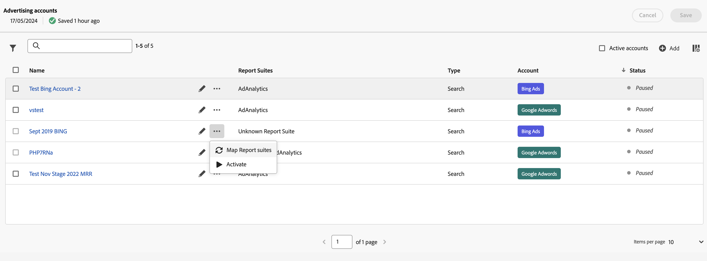

# Werbekonten verwalten

Sie können auf die Benutzeroberfläche für Advertising-Konten zugreifen, indem Sie zu **[!UICONTROL Admin]** > **[!UICONTROL Advertising-Konten]** navigieren.

Es wird eine Tabelle mit den Werbekonten angezeigt. Wenn keine Werbekonten verfügbar sind, wählen Sie **[!UICONTROL Neues Werbekonto erstellen]** aus.

Die Tabelle besteht aus den folgenden Spalten:

| Name oder Element | Beschreibung |
|---|---|
| **[!UICONTROL Name]** | *Name des*. Sie können den Namen auswählen, um die Suchmaschineneinstellungen zu bearbeiten. |
|  | Wählen Sie diese Option aus, um das Werbekonto umzubenennen oder die Suchmaschineneinstellungen zu bearbeiten. |
|  | Wählen Sie diese Option aus, um ein Kontextmenü zu öffnen[ in dem Sie Report Suites zuordnen](#map-reporting-suites) Werbekonten aktivieren [ anhalten ](#activate-or-pause-advertising-accounts). |
| **[!UICONTROL Report Suites]** | Listet die Report Suites auf, denen das Werbekonto zugeordnet ist. |
| **[!UICONTROL Typ]** | Zeigt die Art des Werbekontos an. Standardmäßig ist der Typ [!UICONTROL Suche] |
| **[!UICONTROL Konto]** | Kontotyp anzeigen, entweder [!UICONTROL Bing Ads] oder [!UICONTROL Google Adwords]. |
| **[!UICONTROL Status]** | Der Status des Werbekontos: *Ausgesetzt* oder Aktiv. |

- Um die Liste nach Report Suite, Typ und Status zu filtern, wählen Sie 
- So suchen Sie mithilfe des Suchfelds  nach Ihrem Werbekonto.
- Um aktive Konten in der Tabelle auszuwählen, aktivieren Sie **[!UICONTROL Aktive Konten]**.
- Um zu definieren, welche Spalten für die Tabelle angezeigt werden sollen, wählen Sie  aus.  Im Dialogfeld **[!UICONTROL Tabelle anpassen]**:
  - Wählen Sie die Spalten aus, die angezeigt werden sollen.
  - Wählen Sie **[!UICONTROL Anwenden]** aus.

Wenn Sie ein oder mehrere Werbekonten auswählen, ermöglicht Ihnen eine blaue Aktionsleiste, basierend auf dem Status der ausgewählten Konten,  **[!UICONTROL Umbenennen]**,  **[!UICONTROL Zuordnen von Report Suites]**,  **[!UICONTROL Aktivieren]** oder  Pause **[!UICONTROL Pause]** Werbekonten.

## Werbekonto erstellen

So erstellen Sie ein neues Werbekonto:

1. Wählen Sie  **[!UICONTROL Hinzufügen]** aus.
1. Das Dialogfeld [!UICONTROL Advertising-] > **[!UICONTROL Neues Konto]** wird angezeigt, in dem Sie ein neues Werbekonto definieren können. Weitere [ finden Sie unter „Einrichten eines Advertising](aa-create-ad-account.md)Kontos“.

## Werbekonto bearbeiten

So bearbeiten Sie die Suchmaschineneinstellungen für ein Werbekonto:

- Wählen Sie den Namen des Werbekontos.
- Klicken Bearbeiten“ neben dem Namen des Werbekontos.

## Report Suites zuordnen

So ordnen Sie ein oder mehrere Werbekonten Report Suites zu:

1. (Optional) Wählen Sie mehr als ein Werbekonto aus.
1. Wählen Sie  für ein bestimmtes Werbekonto aus.
1. Wählen  **[!UICONTROL Report Suites zuordnen]** aus dem Kontextmenü aus.
1. Wählen Sie im Dialogfeld Report Suites zuordnen eine oder mehrere Report Suites aus dem Dropdown-Menü aus. Sie können Report Suites aus der Zuordnung mithilfe von &quot;.
1. Klicken Sie **[!UICONTROL Speichern]**, um die Zuordnung zu speichern.

## Werbekonten aktivieren oder pausieren

So aktivieren Sie ein oder mehrere Werbekonten:

1. (Optional) Wählen Sie mehr als ein Werbekonto aus.
1. Wählen Sie  für ein bestimmtes Werbekonto aus.
1. Wählen  die Option **[!UICONTROL Play]** Activate) aus.

So pausieren Sie ein oder mehrere Werbekonten:

1. (Optional) Wählen Sie mehr als ein Werbekonto aus.
1. Wählen Sie  für ein bestimmtes Werbekonto aus.
1. Wählen  **[!UICONTROL Pause]** aus dem Kontextmenü aus.

