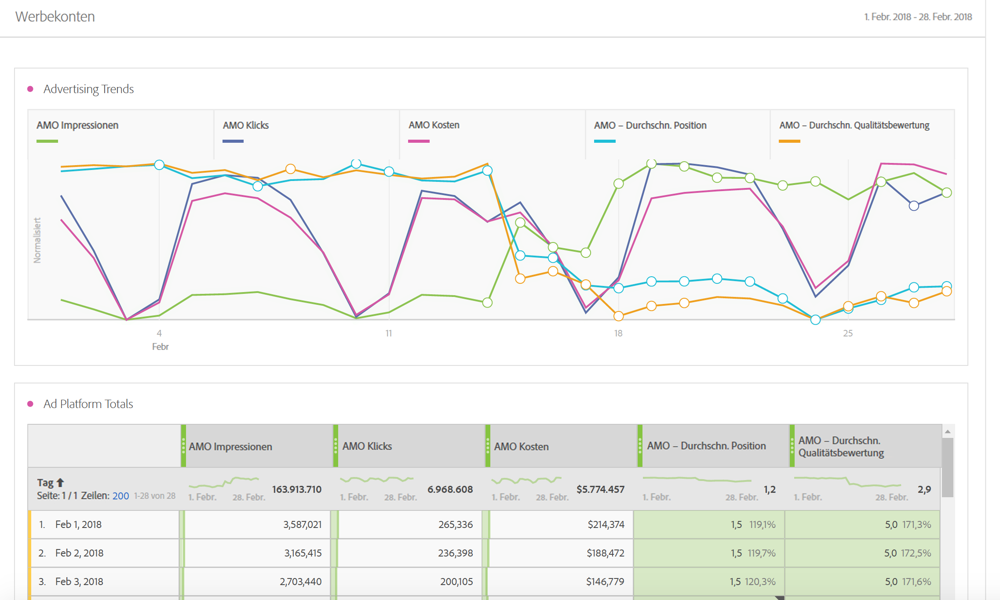
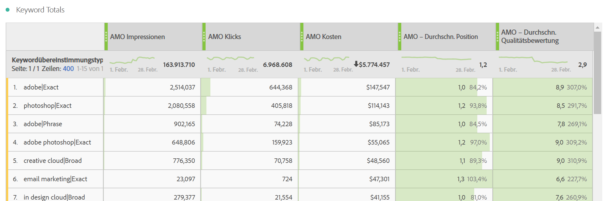
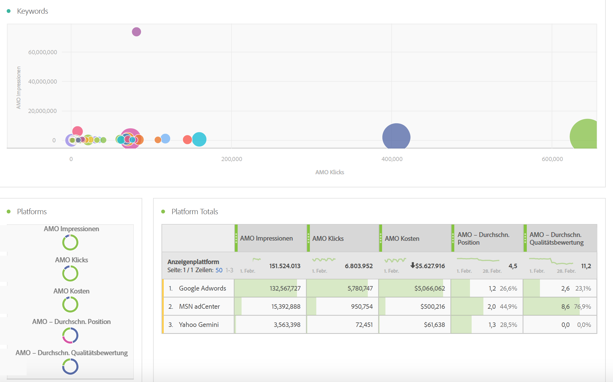
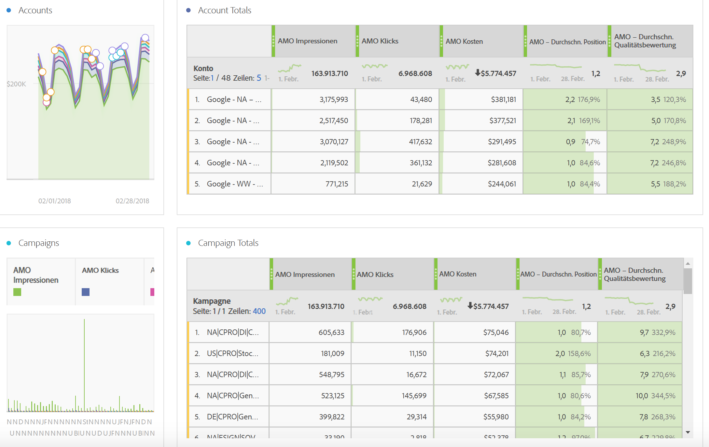
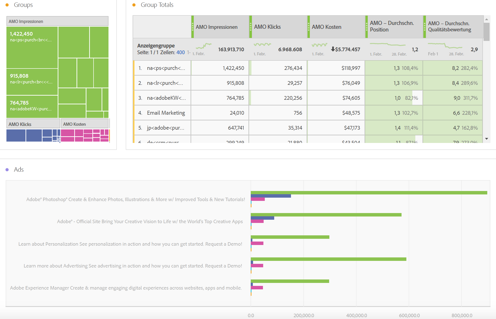
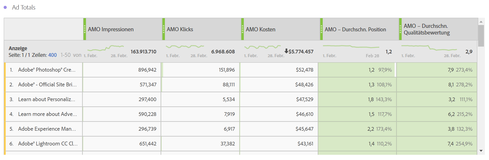

# Bericht zu Werbedaten

Dieser Artikel enthält Details zum Analysis Workspace-Bericht und zur Berichterstellung in Report Builder.

>[!NOTE]
>
>Es dauert in der Regel mindestens 24 Stunden, bis Suchmaschinendaten in Ihren Analytics-Berichten angezeigt werden. Beachten Sie auch, dass die Analytics-Berichterstellung keine Daten für die stündliche Granularität zurückgibt, da die Advertising Cloud-Daten keine stündliche Granularität unterstützen.

## Bericht zur gebührenpflichtigen Suche {#section_8173F42B2C784F41B9FD82CBB66F9ADF}

Mit diesem Bericht kann jeder, der die Suchmaschinenintegration implementiert, in Analytics auf Suchmaschinendaten zugreifen. Sie können darauf über **[!UICONTROL Workspace]** > **[!UICONTROL Berichte]** > **[!UICONTROL Akquise]** > **[!UICONTROL Advertising Analytics: Paid Search]** zugreifen

>[!NOTE]
>
>Der Bericht zur gebührenpflichtigen Suche ist für alle Kunden sichtbar, auch wenn Sie keine Advertising-Konten implementiert haben. Wenn Sie versuchen, den Bericht über gebührenpflichtige Suchvorgänge für ein Unternehmen zu öffnen, das nicht registriert ist, wird eine Fehlermeldung angezeigt, die Ihnen mitteilt, dass Sie kein Suchmaschinenkonto konfiguriert haben. Wählen Sie **[!UICONTROL Jetzt konfigurieren]** aus, wodurch Sie zum Bildschirm [Advertising-Kontoeinrichtung](/help/integrate/c-advertising-analytics/c-adanalytics-workflow/aa-create-ad-account.md) gelangen.

       

| Tabelle/Visualisierung | Beschreibung |
|--- |--- |
| Werbetrends | Tägliche Übersicht mit Trenddaten für AMO-Impressionen, -Klicks und -Kosten |
| Anzeigenplattformen | Kreisdiagramm mit Kosten der führenden zwei Plattformen (Google, Bing) |
| Werbeplattform gesamt | Freiformtabelle der führenden Plattformen, aufgeschlüsselt nach AMO-Impressionen, -Klicks, -Kosten, durchschnittlicher AMO-Position und durchschnittlicher AMO- Qualitätsbewertung. |
| Konten | Zusammengefasster Kostenbereich |
| Konto gesamt | Freiformtabelle der führenden Konten, aufgeschlüsselt nach zugehörigen Metriken |
| Kampagnen | Balkendiagramm der Kampagnenkosten |
| Kampagnen gesamt | Freiformtabelle der führenden Kampagnen, aufgeschlüsselt nach zugehörigen Metriken |
| Gruppen | Baumstruktur der Kosten |
| Gruppe gesamt | Freiformtabelle der führenden Werbegruppen, aufgeschlüsselt nach zugehörigen Metriken |
| Werbeanzeigen | Horizontales Balkendiagramm der Impressionen, Klicks und Kosten |
| Werbeanzeige gesamt | Freiformtabelle der führenden Werbeanzeigen, aufgeschlüsselt nach zugehörigen Metriken |
| Suchbegriffe | Punktdiagramm der Impressionen, Klicks und Kosten für alle Kombinationen aus Keyword und Übereinstimmungstyp |
| Keyword gesamt | Freiformtabelle der führenden Kombinationen aus Keyword und Übereinstimmungstyp, aufgeschlüsselt nach zugehörigen Metriken |

## Report Builder {#section_8E0371CF81144C33990D909685D1726E}

Sobald Sie ein Advertising Analytics-Konto eingerichtet haben, wird der Advertising Analytics-Bericht verfügbar gemacht.
