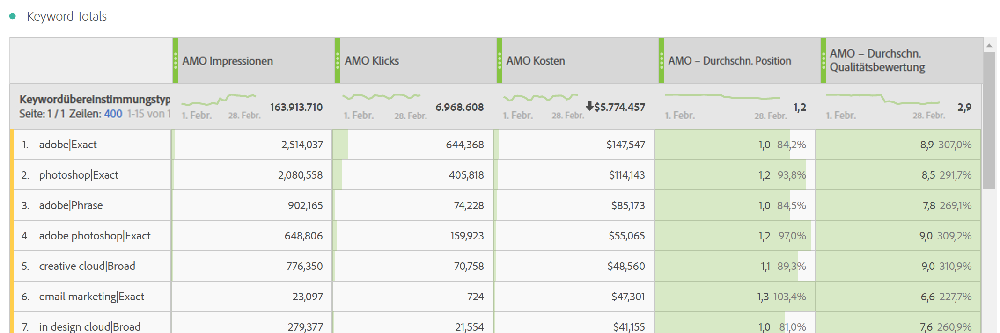
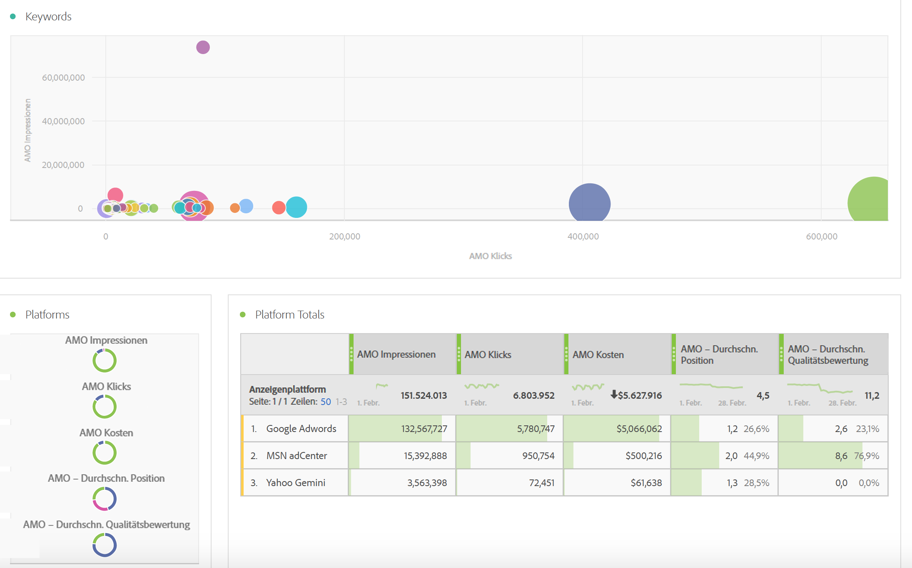
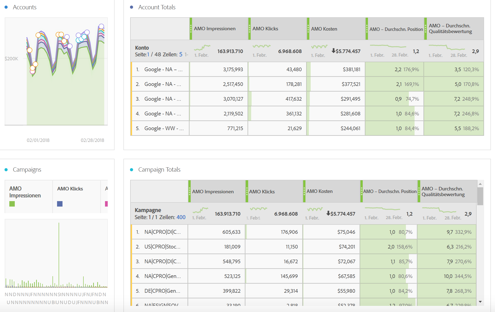
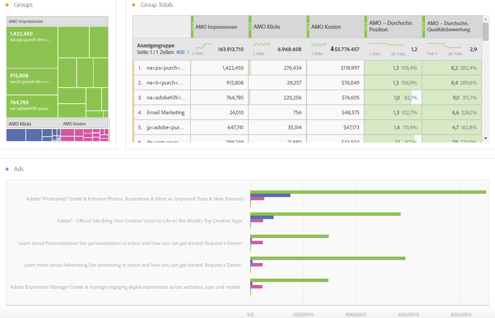
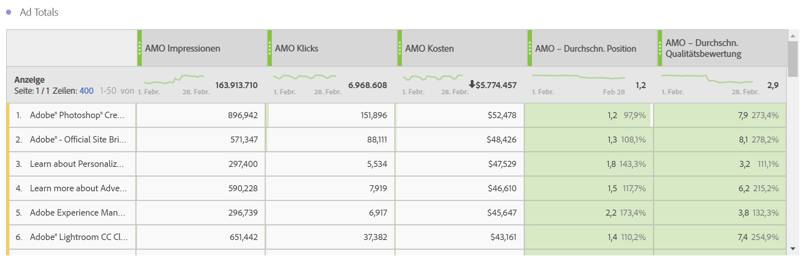

# Bericht zu Werbedaten

Dieser Artikel enthält Details zum Analysis Workspace-Bericht und zum Reporting in Report Builder.

>[!NOTE]
>
>Rechnen Sie damit, dass Sie mindestens 24 Stunden warten müssen, bevor die Suchmaschinendaten in Analytics-Berichte aufgenommen werden. Die Analytics-Berichterstellung gibt keine Daten mit stündlicher Granularität zurück, da Adobe Advertising-Daten keine stündliche Granularität unterstützen.

## Paid Search-Bericht {#section_8173F42B2C784F41B9FD82CBB66F9ADF}

Dieser Bericht ermöglicht allen Personen, die die Suchmaschinenintegration implementieren, den Zugriff auf Suchmaschinendaten in Analytics. Sie können darauf über **[!UICONTROL Workspace]** > **[!UICONTROL Berichte]** > **[!UICONTROL Akquise]** > **[!UICONTROL Advertising Analytics: Paid Search zugreifen]**

>[!NOTE]
>
>Der Paid Search-Bericht ist für alle Kunden sichtbar, auch wenn Sie keine Advertising-Konten implementiert haben. Wenn Sie versuchen, den Paid-Search-Bericht für ein Unternehmen zu öffnen, das nicht bereitgestellt wurde, wird eine Fehlermeldung angezeigt, die besagt, dass Sie kein Suchmaschinenkonto konfiguriert haben. Wählen Sie **[!UICONTROL Jetzt konfigurieren]** aus, um zum Bildschirm [Advertising-Konto-Einrichtung](/help/integrate/c-advertising-analytics/c-adanalytics-workflow/aa-create-ad-account.md) zu gelangen.

       

| Tabelle/Visualisierung | Beschreibung |
|--- |--- |
| Werbetrends | Tägliche Trend-Übersicht für AMO-Impressionen, AMO-Klicks und AMO-Kosten. |
| Werbeplattformen | Ringdiagramm für die Kosten der zwei wichtigsten Plattformen (Google Ads, Microsoft Advertising). |
| Anzeigenplattform gesamt | Freiformtabelle der Top-Plattformen, aufgeschlüsselt nach AMO-Impressionen, AMO-Klicks, AMO-Kosten, AMO-Durchschnitt. Position, AMO-Durchschnitt Qualitätsbewertung. |
| Konten | Gestapelter Kostenbereich. |
| Konto gesamt: | Freiformtabelle der Top-Konten, aufgeschlüsselt nach den zugehörigen Metriken. |
| Kampagnen | Balkendiagramm der Kampagnenkosten. |
| Kampagne gesamt | Freiformtabelle der Top-Kampagnen, aufgeschlüsselt nach den zugehörigen Metriken. |
| Gruppen | Baumdiagramm der Kosten. |
| Gruppe gesamt | Freiformtabelle der Top-Werbegruppen, aufgeschlüsselt nach den zugehörigen Metriken. |
| Werbeanzeigen | Horizontales Balkendiagramm mit Impressionen, Klicks und Kosten. |
| Anzeige gesamt: | Freiformtabelle der Top-Anzeigen, unterteilt nach den zugehörigen Metriken. |
| Suchbegriffe | Streudiagramm der Impressionen, Klicks und Kosten für alle Keyword-/Übereinstimmungstyp-Kombinationen. |
| Keywords gesamt | Freiformtabelle der wichtigsten Kombinationen aus Keyword- und Übereinstimmungstyp, aufgeschlüsselt nach den zugehörigen Metriken. |

## Report Builder {#section_8E0371CF81144C33990D909685D1726E}

Sobald Sie ein Advertising Analytics-Konto eingerichtet haben, wird der Advertising Analytics-Bericht bereitgestellt.
