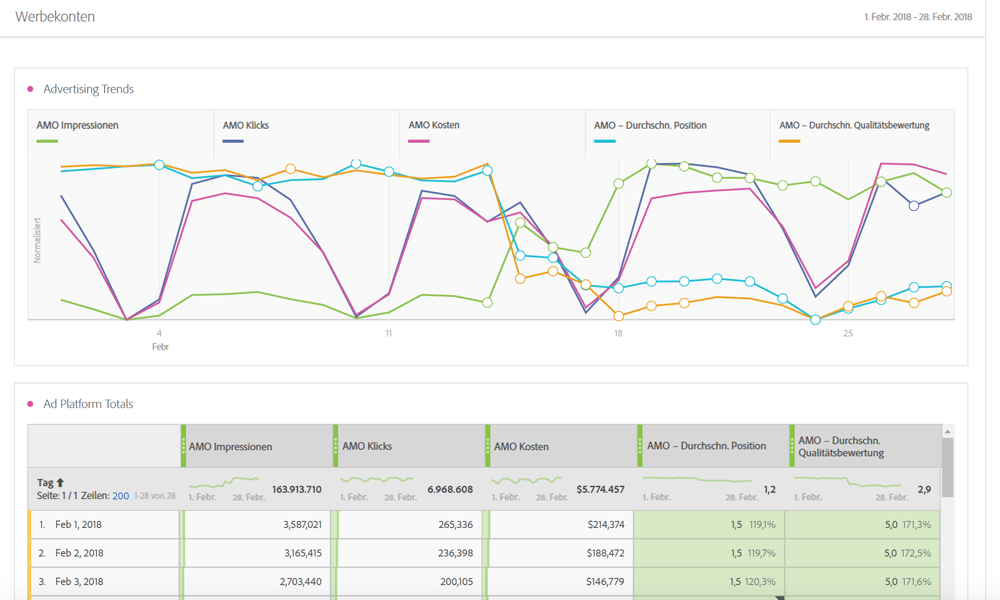

# Advertising Analytics

Mit Advertising Analytics können Sie alle Paid Search-Daten von Google Ads und Microsoft Advertising in Adobe Analytics nebeneinander anzeigen. Zuvor mussten alle Google Ads- oder Microsoft Advertising-Daten in Adobe Advertising oder in jeder entsprechenden Anzeigenschnittstelle angezeigt werden. Sie können jetzt Impressions-, Klick- und Kostendaten direkt von Suchmaschinen sowie AMO ID-Instanzen (Klickinstanzen) erhalten.

Indem Sie die Daten aus diesen Suchmaschinen in Adobe Analytics zusammenführen, können Sie dieselben Daten mithilfe von Analysis Workspace analysieren. Eine neue Vorlage [Paid Search Performance](/help/integrate/c-advertising-analytics/c-adanalytics-workflow/aa-report-ad-data-an.md) in Workspace vereinfacht die Analyse.

Diese Integration richtet sich an die folgenden Zielgruppen:

* Der **Analyst** der Leistungsberichte für den Paid Search-Marketing-Experten sammeln muss.
* Der **Paid Search-**), der Antworten auf diese Fragen sucht: Wie viel Traffic sende ich auf unsere Website und konvertieren Kunden? Was sind meine kosteneffizienten Werbekampagnen?

## Voraussetzungen {#prerequisites}

* Advertising Analytics ist nur für Adobe Analytics [Select](https://www.adobe.com/de/data-analytics-cloud/analytics/select.html), [Prime](https://www.adobe.com/de/data-analytics-cloud/analytics/prime.html) und [Ultimate](https://www.adobe.com/de/data-analytics-cloud/analytics/ultimate.html) SKUs verfügbar.
* Diese Funktion ist für Kunden verfügbar, die Adobe Advertising nicht verwenden.
* Sie müssen ein Adobe Analytics-Administrator sein, um Zugriff auf Advertising Analytics zu erhalten, oder zu einem Produktprofil gehören, dem Zugriff [&#x200B; Advertising Analytics &#x200B;](/help/integrate/c-advertising-analytics/overview.md#permissions) wurde.
* Für jede Report Suite, in der Sie Google Ads- oder Microsoft Advertising-Suchdaten anzeigen möchten, müssen Sie [diese Report Suites für Advertising Analytics aktivieren](/help/integrate/c-advertising-analytics/c-adanalytics-workflow/aa-provision-rs.md) ( **[!UICONTROL Admin]** > **[!UICONTROL Einstellungen bearbeiten]** > **[!UICONTROL Advertising Analytics-Konfiguration]**).
* Sie benötigen Anmeldedaten für einen Benutzer mit Bearbeitungsberechtigungen für die Suchkonten, die Sie in Adobe Analytics integrieren möchten, z. B. eine Google-Konto-ID und ein Kennwort.
* Im Fall von Microsoft Advertising benötigen Sie auch die [[!UICONTROL Konto-ID] und [!UICONTROL Manager-Konto-ID]](c-adanalytics-workflow/aa-locate-account-id.md).

## Advertising Analytics-Berechtigungen {#permissions}

Analytics verfügt über zwei Berechtigungen, die Analytics-Administrierenden automatisch erteilt werden. Administratoren können diese Berechtigungen dann auch Nicht-Administratoren erteilen.

| Berechtigung | Definition | Berechtigung erteilen, wenn Sie bei Adobe Experience Cloud angemeldet sind |
| --- | --- | --- |
| Advertising Analytics-Verwaltung | Ermöglicht Benutzenden das Einrichten/Bearbeiten/Anzeigen von Werbesuchkonten. | Melden Sie sich bei [adminconsole.adobe.com](https://adminconsole.adobe.com) > [!UICONTROL Produkte] > [!UICONTROL Adobe Analytics] > [!UICONTROL Produktprofil] > [!UICONTROL Berechtigungen] Registerkarte > [!UICONTROL Analytics-Tools] > [!UICONTROL Advertising Analytics Management] |
| Advertising Analytics-Konfiguration | Ermöglicht Benutzenden die Konfiguration von Report Suites, die für Advertising Analytics bereitgestellt werden sollen. | Melden Sie sich bei [adminconsole.adobe.com](https://adminconsole.adobe.com) > [!UICONTROL Produkte] > [!UICONTROL Adobe Analytics] > [!UICONTROL Produktprofil] > [!UICONTROL Berechtigungen] Registerkarte > [!UICONTROL Analytics-Tools] > [!UICONTROL Advertising Analytics Configuration] |

## Dimensionen und Metriken in Advertising Analytics {#dimensions-metrics}

Advertising Analytics fügt die folgenden Dimensionen und Metriken zu Analysis Workspace, Report Builder und der Analytics Reporting-API hinzu.

### Dimensionen

>[!IMPORTANT]
>
>Diese Integration erstellt eine neue Gruppe von Dimensionen mithilfe der Klassifizierungen der AMO-ID-Variablen. Diese neuen Dimensionen wirken sich nicht auf Ihre vorhandenen Marketing-Kanäle oder die Dimensionen der Kampagnen-Tracking-Variablen aus. Die AMO-ID ist mit dem Besucherprofil verbunden, wenn ein Besucher über eine Paid-Search-Anzeige auf die Website gelangt. Daher können die AMO-Dimensionen verwendet werden, um sowohl die von dieser Integration bereitgestellten AMO-Metriken als auch alle Daten aufzuschlüsseln, die nachgelagert vom Besucher erfasst werden (Besuche, Besucher, Seitenansichten, Absprungrate, Bestellungen, Umsatz, benutzerdefinierte Ereignisse usw.). Sie können auch nach anderen Dimensionen aufgeschlüsselt werden, wenn Sie Berichte zu anderen Onsite-Metriken erstellen.
>
>Die Klassifizierungen für diese Metriken werden täglich aktualisiert. Wenn Sie also Änderungen an den Metadaten in einer Suchmaschine vornehmen, werden diese Änderungen möglicherweise erst am nächsten Tag widergespiegelt, wenn die Klassifizierungen aktualisiert werden.

| Name der Klassifizierung (Dimension) | Definition |
| --- | --- |
| **[!UICONTROL Keyword MatchType (AMO-ID)]** | Der Übereinstimmungstyp des Keywords. Werte sind normalerweise entweder breit, Phrase, exakt oder kein Wert, wenn der Anzeigetyp keinen Übereinstimmungstyp hat. |
| **[!UICONTROL Anzeigenplattform (AMO-ID)]** | Der Name der Suchmaschine. Werte können &quot;Google AdWords“ oder &quot;Microsoft Bing Ads“ sein. |
| **[!UICONTROL Konto (AMO-ID)]** | Der Name des Suchmaschinenkontos, das verfolgt wird. |
| **[!UICONTROL Campaign (AMO-ID)]** | Der Name der Kampagne in Ihrem Suchmaschinenkonto. |
| **[!UICONTROL Anzeigengruppe (AMO-ID)]** | Der Name der Anzeigengruppe in Ihren Suchmaschinenkampagnen. |
| **[!UICONTROL Anzeige (AMO-ID)]** | Der Anzeigentitel + die Anzeigenbeschreibung, die in Ihrer Anzeige verwendet wird. |
| **[!UICONTROL Keyword (AMO-ID)]** | Der Keyword-Wert aus Ihrem Suchmaschinenkonto. |
| **[!UICONTROL Übereinstimmungstyp (AMO-ID)]** | Der Ihrem Keyword zugewiesene Typ der Keyword-Übereinstimmung. Werte sind normalerweise entweder breit, Phrase, exakt oder kein Wert, wenn der Anzeigetyp keinen Übereinstimmungstyp hat. |
| **[!UICONTROL Ad Type (AMO ID)]** | Der Typ der verarbeiteten Anzeige, normalerweise „Textanzeige“. |
| **[!UICONTROL Anzeigentitel (AMO-ID)]** | Das in Ihrer Anzeige verwendete Titelobjekt. |
| **[!UICONTROL Anzeigenbeschreibung (AMO-ID)]** | Das in Ihrer Anzeige verwendete Anzeigenbeschreibungsobjekt. |
| **[!UICONTROL Anzeige-URL (AMO-ID)]** | Das in Ihrer Anzeige verwendete URL-Objekt für die Anzeigenanzeige. |
| **[!UICONTROL Werbeziel-URL (AMO-ID)]** | Die Landingpage-URL oder die endgültige URL, die Ihrer Anzeige zugewiesen ist. |
| **[!UICONTROL Netzwerk (AMO-ID)]** | Das Netzwerk, in dem die Anzeige geschaltet wird. Bei Advertising Analytics lautet dieser Wert immer „Suche“. |
| **[!UICONTROL Platzierung (AMO-ID)]** | Die verwaltete Platzierungs-Website (für Inhaltsnetzwerke). Nur verwaltete Platzierungen verwenden diese Dimension. |
| **[!UICONTROL Produktzielgruppe (AMO-ID)]** | Der Name der Zielgruppe des Produkts, der auf PLA-Anzeigen verwendet wird (nicht das tatsächlich gekaufte Produkt). |
| **[!UICONTROL Optimierung (AMO-ID)]** | Wird nicht von Advertising Analytics verwendet. Sie wird nur von Adobe Advertising-Kunden verwendet. |
| **[!UICONTROL Gerät (AMO-ID)]** | Heute nicht verwendet. Platzhalter für potenzielle künftige Produktverbesserung auf den angegebenen Zielgerätetyp (z. B. Mobiltelefon, Desktop) der Anzeige (nicht das tatsächliche Gerät des Besuchers). |

### Metriken

>[!IMPORTANT]
>
>Bei den von Advertising Analytics bereitgestellten Metriken (siehe unten) handelt es sich um Zusammenfassungsdaten aus den Suchmaschinen. Sie sind nicht mit den Analytics-Besucherprofilen verbunden. Sie sind nur mit der AMO-ID-Variablen und den zugehörigen Classification-Dimensionen verknüpft. Daher sollten sie nicht von anderen Dimensionen/Segmenten gemeldet werden als denjenigen, die auf den AMO ID-Dimensionen basieren. Andernfalls zeigt Analytics Nullen für die Daten an. Sie können sie in berechnete Metriken mit anderen Metriken einbeziehen. Diese berechneten Metriken sollten jedoch auch nur nach den AMO-ID-Dimensionen aufgeschlüsselt werden.
>
>Diese Metriken werden täglich aus Datenquellen bezogen, sodass sie keine Daten für den aktuellen Tag enthalten. Sie sollten auch nicht mit einer Granularität berichtet werden, die niedriger als täglich ist.
>
>Es gibt eine AMO ID-Instanzmetrik, die festgelegt wird, wenn die AMO-ID auf einer Landingpage festgelegt wird (d. h. durch einen Clickthrough). Diese Metrik wird in Echtzeit mit dem Landingpage-Treffer erfasst und ist für Aufschlüsselungen mit anderen Dimensionen verfügbar, die auch auf der Landingpage festgelegt sind.

| Metrikname | Definition |
| --- | --- |
| **[!UICONTROL AMO-Impressionen]** | Die Anzahl der Ad-Impressions, wie von der Suchmaschine gemeldet. |
| **[!UICONTROL AMO-Klicks]** | Die Anzahl der Klicks auf Anzeigen, wie von der Suchmaschine gemeldet. |
| **[!UICONTROL AMO-Kosten]** | Die für jedes Keyword/jede Anzeige gezahlten Kosten, wie von der Suchmaschine angegeben. |
