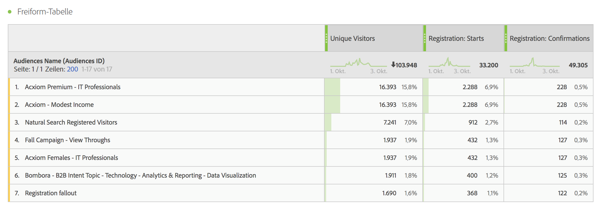
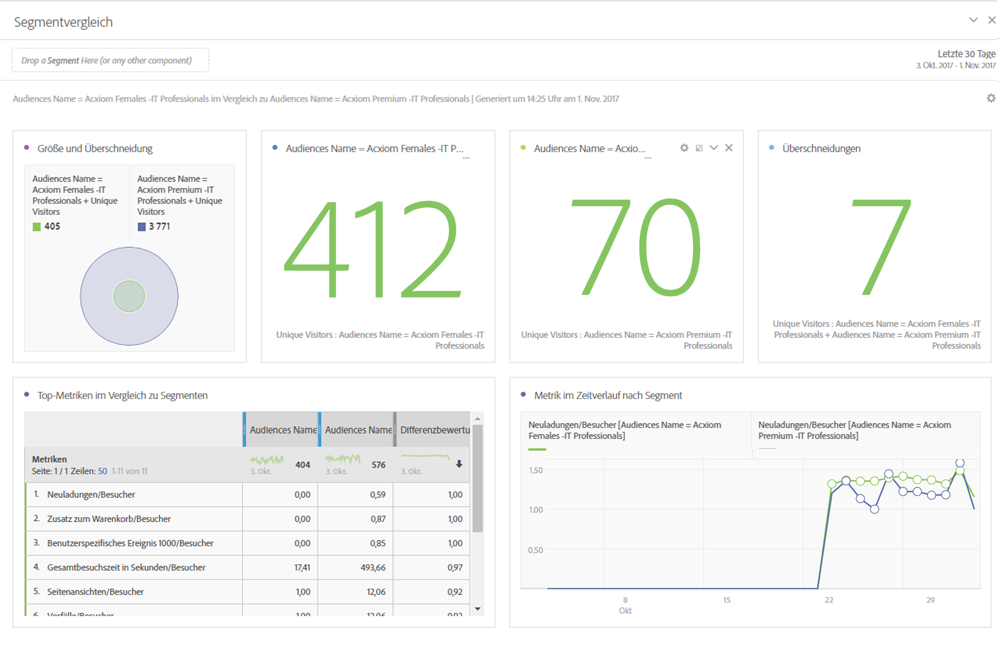
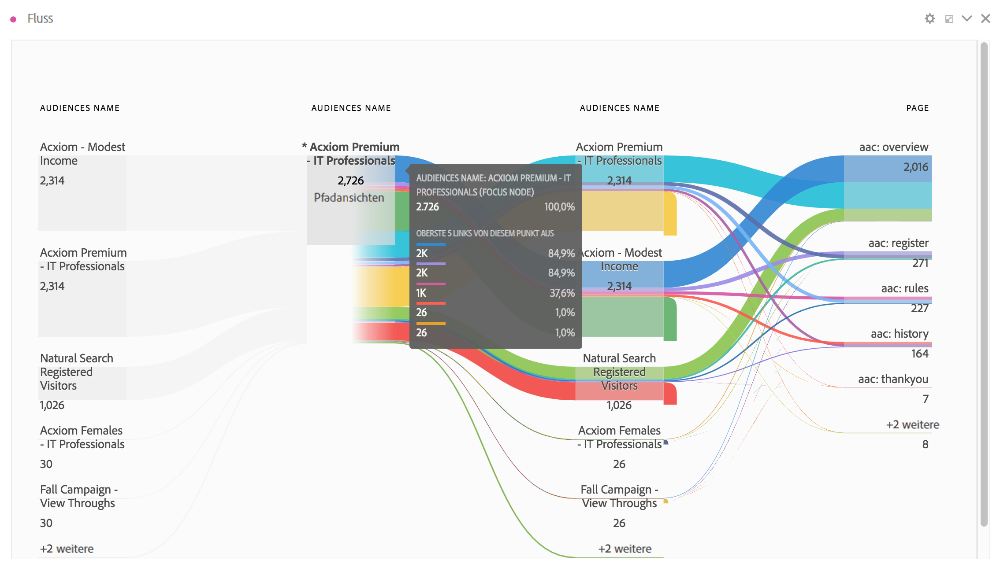
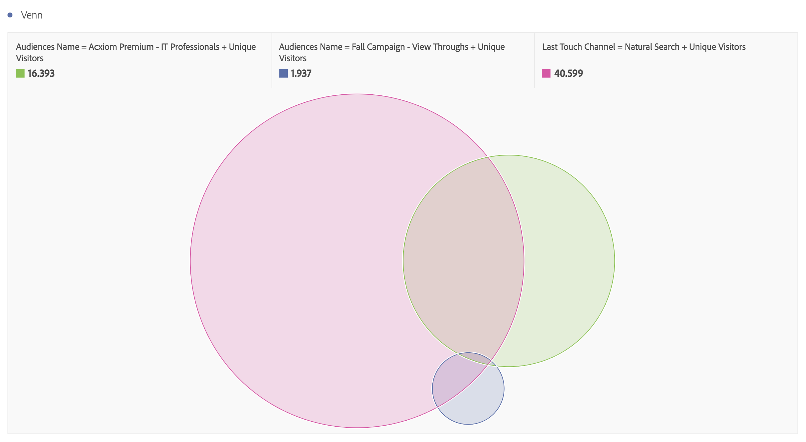
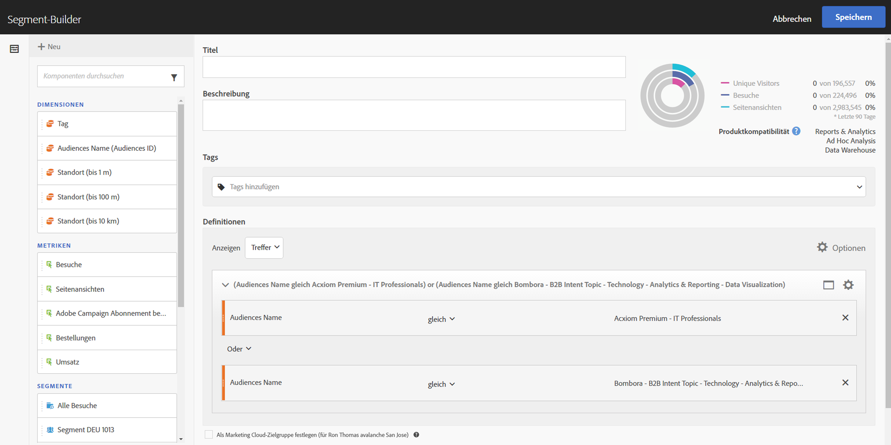

# Zielgruppendaten in Analytics verwenden

Sie können die Adobe Audience Manager-Zielgruppendimensionen in Analytics verwenden. Die integrierten Segmente sind neue Analytics-Dimensionen namens Zielgruppen-ID und Zielgruppenname und können wie jede andere Dimension verwendet werden, die von Analytics erfasst wird. In Daten-Feeds werden die Zielgruppen-IDs in der Spalte „mc_audiences“ gespeichert. Diese Dimensionen sind derzeit nicht in Data Workbench oder Livestream verfügbar. Beispiele für die Nutzung der Zielgruppen-Dimensionen:

## Analysis Workspace {#workspace}

In Analysis Workspace werden die Adobe Audience Manager-Segmente als zwei Dimensionen angezeigt.

1. Wechseln Sie zu **[!UICONTROL Arbeitsbereich]**.
1. Wählen Sie aus der Liste **[!UICONTROL Dimensionen]** die Dimensionen **[!UICONTROL Zielgruppen-ID]** oder **[!UICONTROL Zielgruppenname]**. Der Name ist eine Anzeige-Classification der ID.

   

## Segmentvergleich {#compare}

Der [Segmentvergleich](/help/analyze/analysis-workspace/c-panels/c-segment-comparison/segment-comparison.md) findet die statistisch relevantesten Unterschiede zwischen zwei Segmenten. Zielgruppen-Daten können im Segmentvergleich auf zwei Arten verwendet werden: 1) als die 2 Segmente, die verglichen werden, und 2) als Elemente in der Tabelle „Top-Dimensionselemente“.

1. Wechseln Sie zu **[!UICONTROL Arbeitsbereich]** und wählen Sie in der linken Schiene das Bedienfeld **[!UICONTROL Segmentvergleich]** aus.

1. Suchen Sie [!UICONTROL Zielgruppenname] im Menü **[!UICONTROL Komponente]**.

1. Öffnen Sie [!UICONTROL Zielgruppenname]. Daraufhin werden die damit verbundenen Dimensionselemente angezeigt.
1. Ziehen Sie die zu vergleichenden Zielgruppen in den Segmentvergleich-Builder.
1. (Optional): Sie können auch andere Dimensionselemente oder Segmente miteinbeziehen, es können bis zu zwei davon verglichen werden.
1. Klicken Sie auf **[!UICONTROL Erstellen]**.

   Die Dimensionen „Zielgruppen-ID“ und „Zielgruppen-Name“ werden automatisch in der Tabelle „Top-Dimensionselemente“ angezeigt, da sie zusätzliche Profildaten für die beiden verglichenen Segmente sind.

   

## Customer Journey (Fluss) in Analysis Workspace {#flow}

Adobe Audience Manager-Segmentdaten werden von Treffer zu Treffer an Analytics übergeben und stellen die Zielgruppenzugehörigkeit eines Besuchers zu diesem Zeitpunkt dar. Das bedeutet, dass ein Besucher einem Segment zugehörig sein kann (z. B. „Bewusstsein“) und sich später für ein qualifizierteres Segment qualifizieren könnte (z. B. „Überlegung“). Sie können [Flow](/help/analyze/analysis-workspace/visualizations/fallout/fallout-flow.md) in Analysis Workspace verwenden, um die Journey zu visualisieren, die ein Besucher zwischen Audiences durchführt.

1. Wechseln Sie zu **[!UICONTROL Arbeitsbereich]** und wählen Sie in der linken Schiene die Visualisierung **[!UICONTROL Fluss]** aus.

1. Ziehen Sie die Dimension [!UICONTROL Zielgruppenname] in den Flow Builder.
1. Klicken Sie auf **[!UICONTROL Erstellen]**.
1. (Optional): Ziehen Sie eine beliebige weitere Dimension in die Flussvisualisierung, um einen [interdimensionalen Fluss](/help/analyze/analysis-workspace/visualizations/c-flow/multi-dimensional-flow.md) zu erstellen.

Zielgruppen können außerdem für [Fallout-Visualisierungen](/help/analyze/analysis-workspace/visualizations/fallout/fallout-flow.md) verwendet werden.

## Venn-Visualisierung in Analysis Workspace {#venn}

[Venn](/help/analyze/analysis-workspace/visualizations/venn.md)Visualisierungen zeigen Überschneidungen zwischen bis zu drei Segmenten an.

1. Wechseln Sie zu **[!UICONTROL Arbeitsbereich]** und wählen Sie in der linken Schiene die Visualisierung **[!UICONTROL Venn]** aus.

1. Suchen Sie [!UICONTROL  Komponentenmenü nach ]Zielgruppenname“.
1. Öffnen Sie [!UICONTROL Zielgruppenname], damit die zugehörigen Dimensionselemente angezeigt werden.
1. Ziehen Sie die Zielgruppen, die Sie vergleichen möchten, in den Venn Builder.
1. (Optional): Sie können auch andere Dimensionselemente oder Segmente einbringen; bis zu 3 können verglichen werden.
1. Klicken Sie auf **[!UICONTROL Erstellen]**.

## Segment Builder {#builder}

Sie können die Zielgruppendimensionen zusammen mit den von Analytics erfassten Verhaltensinformationen in den [Segment Builder](/help/components/segmentation/segmentation-workflow/seg-build.md) von Analytics eingeben.

1. Wechseln Sie zu **[!UICONTROL Komponenten]** > **[!UICONTROL Segmente]**.
1. Klicken Sie auf **[!UICONTROL Hinzufügen]**, um ein neues Segment zu erstellen.
1. Ziehen Sie nach der Benennung des Segments die Dimension [!UICONTROL Zielgruppenname] in das Bedienfeld Definitionen .
1. (Optional): Fügen Sie dem Segment weitere Kriterien hinzu.
1. Speichern Sie das Segment.

   

