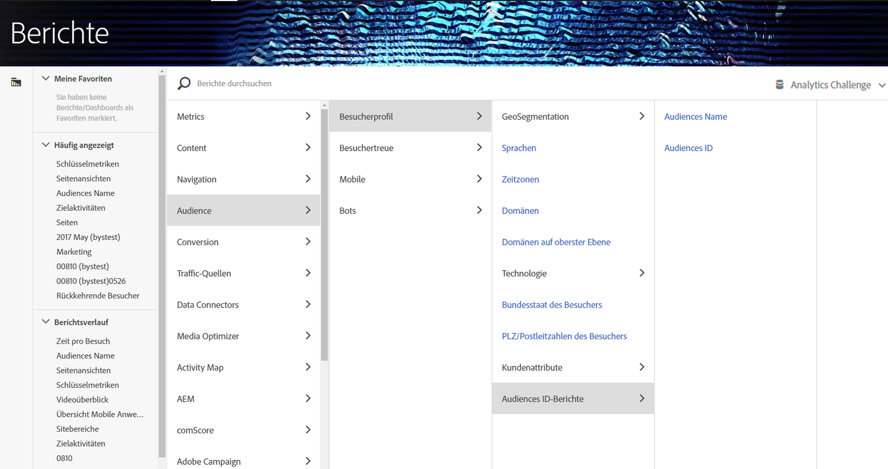

# Zielgruppendaten in Analytics verwenden

Sie können die AAM Zielgruppen-Dimensionen überall in Analytics nutzen. Die integrierten Segmente sind neue Analytics-Dimensionen namens „Zielgruppen-ID“ und „Zielgruppenname“. Diese können genau wie alle anderen von Analytics gesammelten Dimensionen gesammelt werden. In Daten-Feeds werden die Zielgruppen-IDs in der Spalte „mc_audiences“ gespeichert. Diese Dimensionen sind derzeit nicht in Data Workbench oder Livestream verfügbar. Nachfolgend finden Sie einige Beispiele dafür, wie die Zielgruppen-Dimensionen verwendet werden können:

## Analysis Workspace {#section_C70837499BEA4DED885B3486C9E02C68}

In Analysis Workspace erscheinen die AAM-Segmente als zwei Dimensionen.

1. Öffnen von **[!UICONTROL Workspace]**.
1. Wählen Sie in der Liste von **[!UICONTROL Dimensions]** die Dimensionen **[!UICONTROL Audience ID]** oder **[!UICONTROL Audience Name]**. Der Name ist eine Anzeige-Classification der ID.

   

## Segmentvergleich {#section_E72B80B6470C42D4B9B19BE90E6070A2}

Der [Segmentvergleich](https://docs.adobe.com/content/help/de-DE/analytics/analyze/analysis-workspace/panels/segment-comparison/segment-comparison.html) findet die statistisch relevantesten Unterschiede zwischen zwei Segmenten. Audiences-Daten können im Segmentvergleich auf zwei Arten verwendet werden: 1) als die 2 Segmente, die verglichen werden, und 2) als Elemente in der Tabelle „Top-Dimensionselemente“.

1. Go to **[!UICONTROL Workspace]** and select the **[!UICONTROL Segment Comparison]** panel from the left rail.

1. Suchen Sie [!UICONTROL Audiences Name] im **[!UICONTROL Component]** Menü.

1. Open [!UICONTROL Audiences Name]so that the related dimension items appear.
1. Ziehen Sie die Zielgruppen, die Sie vergleichen möchten, in den Segmentvergleichsaufbau.
1. (Optional): Sie können auch andere Dimensionselemente oder Segmente miteinbeziehen, es können bis zu zwei davon verglichen werden.
1. Klicken Sie auf **[!UICONTROL Build]**.

   Die Dimensionen „Zielgruppen-ID“ und „Zielgruppen-Name“ werden automatisch in der Tabelle „Top-Dimensionselemente“ angezeigt, da sie zusätzliche Profildaten für die beiden verglichenen Segmente sind.

   

## Customer Journey (Fluss) in Analysis Workspace {#section_FC30E5795C9D4539838E30FE11FAEA6E}

AAM-Segmentdaten werden pro Treffer an Analytics weitergeleitet und stellen die Zugehörigkeit eines Besuchers zu Zielgruppen zu diesem Zeitpunkt dar. Das bedeutet, dass ein Besucher einem Segment zugehörig sein kann (z. B. „Bewusstsein“) und sich später für ein qualifizierteres Segment qualifizieren könnte (z. B. „Überlegung“). Sie können [Fluss](https://docs.adobe.com/content/help/de-DE/analytics/analyze/analysis-workspace/visualizations/fallout/fallout-flow.html) in Analysis Workspace verwenden, um die Customer Journey eines Besuchers zwischen zwei Zielgruppen zu visualisieren.

1. Go to **[!UICONTROL Workspace]** and select the **[!UICONTROL Flow]** visualization from the left rail.

1. Drag the [!UICONTROL Audience Name] dimension into the Flow builder.
1. Klicken Sie auf **[!UICONTROL Build]**.
1. (Optional): Ziehen Sie eine beliebige weitere Dimension in die Flussvisualisierung, um einen [interdimensionalen Fluss](https://docs.adobe.com/content/help/en/analytics/analyze/analysis-workspace/visualizations/flow/multi-dimensional-flow.html) zu erstellen.

Zielgruppen können außerdem für [Abgangsvisualisierungen](https://docs.adobe.com/content/help/de-DE/analytics/analyze/analysis-workspace/visualizations/fallout/fallout-flow.html) verwendet werden.

## Venn-Visualisierung in Analysis Workspace  {#section_E78AB764FB5047148B51DC1526B0DF89}

[Venn-Visualisierungen](https://docs.adobe.com/content/help/en/analytics/analyze/analysis-workspace/visualizations/venn.html) zeigen Überlappungen zwischen bis zu 3 Segmenten.

1. Go to **[!UICONTROL Workspace]** and select the **[!UICONTROL Venn]** visualization from the left rail.

1. Suchen Sie [!UICONTROL Audience Name] im Komponentenmenü.
1. Open [!UICONTROL Audience Name] so that the related dimension items appear.
1. Ziehen Sie die Zielgruppen, die Sie vergleichen möchten, in den Vennaufbau.
1. (Optional): Sie können auch andere Dimensionselemente oder Segmente miteinbeziehen; es können bis zu drei davon verglichen werden.
1. Klicken Sie auf **[!UICONTROL Build]**.

## Segmentaufbau {#section_2AA81852A1404AB894472CA8959461B6}

Sie können die Zielgruppendimensionen zusammen mit den von Analytics erfassten Verhaltensinformationen in den Analytics-[Segmentaufbau](/help/components/c-segmentation/c-segmentation-workflow/seg-build.md) eingeben.

1. Öffnen von  **[!UICONTROL Components]** > **[!UICONTROL Segments]** .
1. Click **[!UICONTROL Add]** to create a new segment.
1. After naming the segment, drag the [!UICONTROL Audience Name] dimension into the Definitions panel.
1. (Optional): Fügen Sie ein weiteres Kriterium zum Segment hinzu.
1. Speichern Sie das Segment.

   

## Reports &amp; Analysen und ReportBuilder  {#section_04E8FD30F73344D7937AD3C6CD19E34A}

1. Zur Ansicht des Analytics-Berichts navigieren Sie zu **[!UICONTROL Reports]** > **[!UICONTROL Visitor Profile]** > **[!UICONTROL Audience ID Reports]** .
1. Über diesen Ordner können Sie sowohl auf die Dimension „Zielgruppen-ID“ als auch auf die Dimension „Zielgruppenname“ zugreifen.

   

