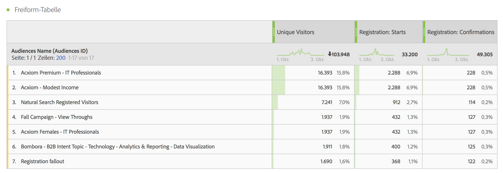
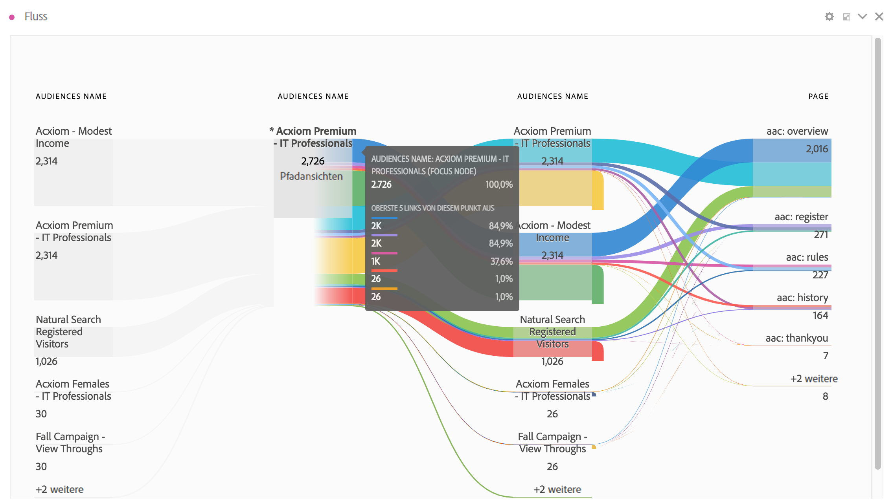
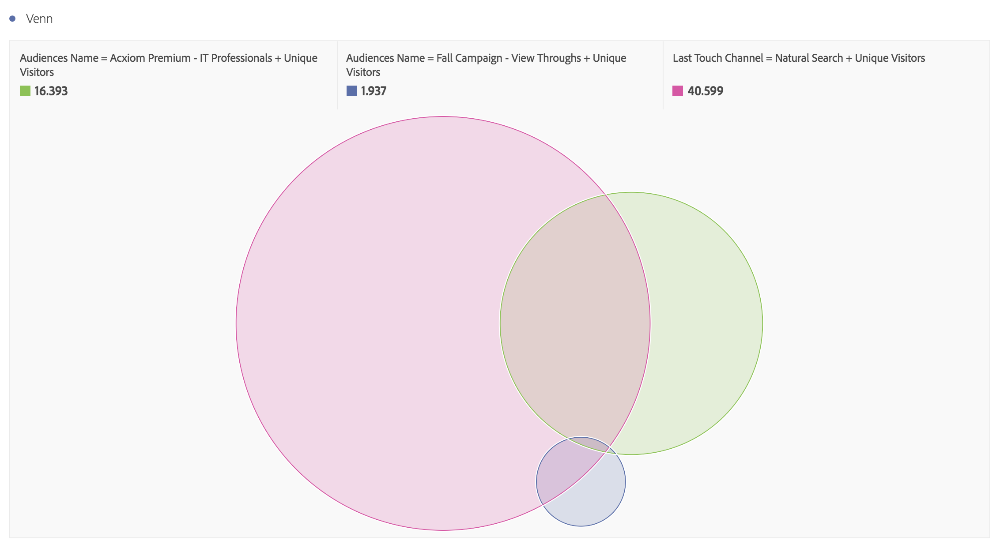

# Zielgruppendaten in Analytics verwenden

Sie können die Adobe Audience Manager-Zielgruppendimensionen in Analytics verwenden. Die integrierten Segmente sind neue Analytics-Dimensionen namens „Zielgruppen-ID“ und „Zielgruppenname“. Diese können genau wie alle anderen von Analytics gesammelten Dimensionen gesammelt werden. In Daten-Feeds werden die Zielgruppen-IDs in der Spalte „mc_audiences“ gespeichert. Diese Dimensionen sind derzeit nicht in Data Workbench oder Livestream verfügbar. Nachfolgend finden Sie einige Beispiele dafür, wie die Zielgruppen-Dimensionen verwendet werden können:

## Analysis Workspace {#workspace}

In Analysis Workspace werden die Adobe Audience Manager-Segmente als zwei Dimensionen angezeigt.

1. Wechseln Sie zu **[!UICONTROL Arbeitsbereich]**.
1. Wählen Sie aus der Liste der **[!UICONTROL Dimensionen]** die Dimensionen **[!UICONTROL Zielgruppen-ID]** oder **[!UICONTROL Zielgruppenname]** aus. Der Name ist eine Anzeige-Classification der ID.

   

## Segmentvergleich {#compare}

Der [Segmentvergleich](https://experienceleague.adobe.com/docs/analytics/analyze/analysis-workspace/panels/segment-comparison/segment-comparison.html?lang=de) findet die statistisch relevantesten Unterschiede zwischen zwei Segmenten. Audiences-Daten können im Segmentvergleich auf zwei Arten verwendet werden: 1) als die 2 Segmente, die verglichen werden, und 2) als Elemente in der Tabelle „Top-Dimensionselemente“.

1. Wechseln Sie zu **[!UICONTROL Arbeitsbereich]** und wählen Sie in der linken Schiene das Bedienfeld **[!UICONTROL Segmentvergleich]** aus.

1. Suchen Sie im Menü **[!UICONTROL Komponente]** nach [!UICONTROL Zielgruppenname].

1. Öffnen Sie [!UICONTROL Zielgruppenname]. Daraufhin werden die damit verbundenen Dimensionselemente angezeigt.
1. Ziehen Sie die Zielgruppen, die Sie vergleichen möchten, in den Segmentvergleichsaufbau.
1. (Optional): Sie können auch andere Dimensionselemente oder Segmente miteinbeziehen, es können bis zu zwei davon verglichen werden.
1. Klicken Sie auf **[!UICONTROL Erstellen]**.

   Die Dimensionen „Zielgruppen-ID“ und „Zielgruppen-Name“ werden automatisch in der Tabelle „Top-Dimensionselemente“ angezeigt, da sie zusätzliche Profildaten für die beiden verglichenen Segmente sind.

   

## Customer Journey (Fluss) in Analysis Workspace {#flow}

Adobe Audience Manager-Segmentdaten werden von Treffer zu Treffer an Analytics übergeben und stellen die Zielgruppenzugehörigkeit eines Besuchers zu diesem Zeitpunkt dar. Das bedeutet, dass ein Besucher einem Segment zugehörig sein kann (z. B. „Bewusstsein“) und sich später für ein qualifizierteres Segment qualifizieren könnte (z. B. „Überlegung“). Sie können [Fluss](https://experienceleague.adobe.com/docs/analytics/analyze/analysis-workspace/visualizations/fallout/fallout-flow.html?lang=de) in Analysis Workspace verwenden, um die Customer Journey eines Besuchers zwischen zwei Zielgruppen zu visualisieren.

1. Wechseln Sie zu **[!UICONTROL Arbeitsbereich]** und wählen Sie in der linken Schiene die Visualisierung **[!UICONTROL Fluss]** aus.

1. Ziehen Sie die Dimension [!UICONTROL Zielgruppenname] in den Flussaufbau.
1. Klicken Sie auf **[!UICONTROL Erstellen]**.
1. (Optional): Ziehen Sie eine beliebige weitere Dimension in die Flussvisualisierung, um einen [interdimensionalen Fluss](https://experienceleague.adobe.com/docs/analytics/analyze/analysis-workspace/visualizations/flow/multi-dimensional-flow.html?lang=de) zu erstellen.

Zielgruppen können außerdem für [Fallout-Visualisierungen](https://experienceleague.adobe.com/docs/analytics/analyze/analysis-workspace/visualizations/fallout/fallout-flow.html?lang=de) verwendet werden.

## Venn-Visualisierung in Analysis Workspace {#venn}

[Venn-Visualisierungen](https://experienceleague.adobe.com/docs/analytics/analyze/analysis-workspace/visualizations/venn.html?lang=de) zeigen Überlappungen zwischen bis zu 3 Segmenten.

1. Wechseln Sie zu **[!UICONTROL Arbeitsbereich]** und wählen Sie in der linken Schiene die Visualisierung **[!UICONTROL Venn]** aus.

1. Suchen Sie nach [!UICONTROL Zielgruppenname] im Menü „Komponente“.
1. Öffnen Sie [!UICONTROL Zielgruppenname]. Daraufhin werden die damit verbundenen Dimensionselemente angezeigt.
1. Ziehen Sie die Zielgruppen, die Sie vergleichen möchten, in den Vennaufbau.
1. (Optional): Sie können auch andere Dimensionselemente oder Segmente miteinbeziehen; es können bis zu drei davon verglichen werden.
1. Klicken Sie auf **[!UICONTROL Erstellen]**.

## Segmentaufbau {#builder}

Sie können die Zielgruppendimensionen zusammen mit den von Analytics erfassten Verhaltensinformationen in den Analytics-[Segmentaufbau](/help/components/segmentation/segmentation-workflow/seg-build.md) eingeben.

1. Wechseln Sie zu **[!UICONTROL Komponenten]** > **[!UICONTROL Segmente]**.
1. Klicken Sie auf **[!UICONTROL Hinzufügen]**, um ein neues Segment zu erstellen.
1. Nachdem Sie das Segment benannt haben, ziehen Sie die Dimension [!UICONTROL Zielgruppenname] in das Bedienfeld „Dimensionen“.
1. (Optional): Fügen Sie ein weiteres Kriterium zum Segment hinzu.
1. Speichern Sie das Segment.

   

