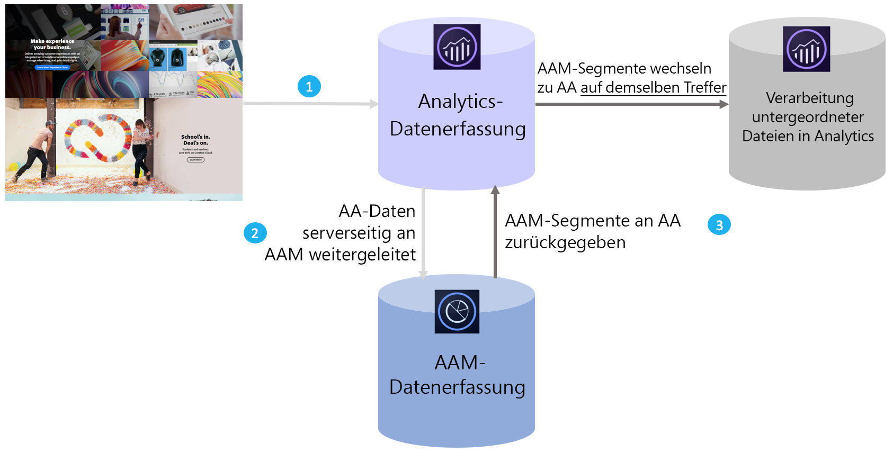

# Audience Analytics-Übersicht

Adobe Audience Manager (Adobe Audience Manager) ist eine leistungsstarke Datenverwaltungsplattform, mit der Sie eindeutige Zielgruppenprofile aus Datenintegrationen von Erstanbietern, Zweitanbietern/Partnern und Drittanbietern erstellen können. Advertiser können mithilfe dieser Zielgruppenprofile die wertvollsten Segmente für beliebige digitale Kanäle ermitteln.

Mit der Audience Analytics-Integration können Sie Zielgruppendaten von Adobe Audience Manager wie demografische Informationen (z. B. Geschlecht oder Einkommensstufe), psychografische Informationen (z. B. Interessen und Hobbys), CRM-Daten und Daten zu Anzeigenimpressionen in alle Analytics-Workflows integrieren.

>[!BEGINSHADEBOX]

Unter  [Audience Analytics](https://video.tv.adobe.com/v/40732?quality=12&learn=on&captions=ger){target="_blank"} finden Sie ein Demovideo.

>[!ENDSHADEBOX]

## Wesentliche Vorteile  {#benefits}

Die Audience Analytics-Integration umfasst die folgenden wesentlichen Vorteile:

* Es ist die erste zu einem eigenen Produkt gemachte Integration zwischen einer Daten-Management-Plattform (DMP) und einer Analyse-Engine auf dem Markt.
* Segmente werden von Adobe Audience Manager in Echtzeit für Analytics freigegeben, um Informationen zu Zielgruppenerkennung, Segmentierung und Optimierung zu erhalten.
* Alle Adobe Audience Manager-Segmente werden standardmäßig freigegeben, wodurch die Kundenprofile in Analytics vollständig erweitert werden.
* Administratoren der Lösung können die Integration über die Benutzeroberfläche aktivieren. Dabei ist nur eine minimale Anpassung des Codes erforderlich.
* Es werden nur Segmente freigegeben, die den Bestimmungen für das Exportieren von Audience Manager-Daten entsprechen.

## Funktionsweise von Audience Analytics {#works}

1. Bei jedem Besuch eines Benutzers Ihrer digitalen Eigenschaften werden Treffer gesammelt und an Analytics weitergeleitet.
1. Bei [Server-seitigen Weiterleitung](/help/admin/tools/manage-rs/edit-settings/general/c-server-side-forwarding/ssf.md) wird jeder Treffer, den Analytics erhält, automatisch in Echtzeit an Adobe Audience Manager gesendet.
1. Durch die Audience Analytics-Integration wird für jeden Treffer die Zielgruppenzugehörigkeit eines Besuchers in Adobe Audience Manager nachgeschlagen und eine Liste der Segment-IDs zur Verarbeitung in Echtzeit an Analytics zurückgegeben.

Da Adobe Audience Manager-Segmente auf der Basis desselben Treffers eingefügt werden, können Sie sicher sein, dass alle in Adobe Audience Manager verfügbaren Daten über einen Besucher nicht verpasst werden und für diesen Treffer auf dem neuesten Stand sind. Dies ist einem AppMeasurement-Plugin überlegen, da ein Plugin diese Segmente erst beim nächsten Treffer (und nicht schon beim aktuellen Treffer) verfügbar machen kann.

Darüber hinaus klassifizieren wir die Segment-IDs von Adobe Audience Manager automatisch anhand der Anzeigenamen für Sie, sodass Sie sich keine alphanumerischen IDs in Analytics-Berichten ansehen müssen.

## Voraussetzungen {#prerequisites}

Stellen Sie sicher, dass folgende Voraussetzungen erfüllt sind:

* Sie sind Kunde sowohl von Audience Manager als auch von Adobe Analytics.
* Sie sind ein Audience Manager-Administrator.
* Sie verwenden den Identitätsdienst v1.5 oder höher.
* Adobe Audience Manager und Adobe Analytics Report Suites sind derselben Experience Cloud-Organisation zugeordnet.
* Sie nutzen [die serverseitige Weiterleitung](/help/admin/tools/manage-rs/edit-settings/general/c-server-side-forwarding/ssf.md) und haben das [Zielgruppen-Management-Modul](https://experienceleague.adobe.com/docs/audience-manager/user-guide/implementation-integration-guides/integration-other-solutions/audience-management-module.html?lang=de) AppMeasurement 1.5 oder höher (kein DIL-Code) implementiert.

Diese Voraussetzungen werden im [Audience Analytics-Workflow](/help/integrate/c-audience-analytics/c-workflow/audiences-workflow.md) beschrieben.
