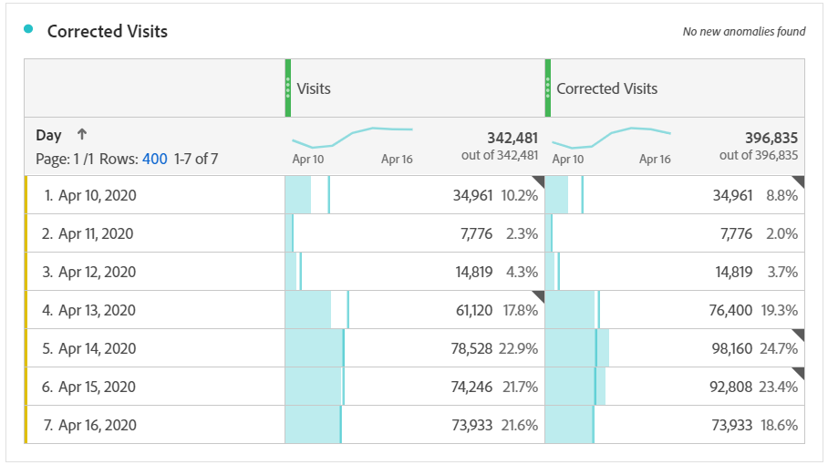

# Ableiten von Daten, die von Ereignissen betroffen sind

Wenn Sie Daten haben [von einem Ereignis betroffen](overview.md) können Sie berechnete Metriken verwenden, um geschätzte Werte für die Dauer des Ereignisses abzuleiten. Wenn beispielsweise ein Ereignis einen Rückgang der Daten um 25 % verursacht hat, können Sie dieses Ereignis als Multiplikator in einer berechneten Metrik verwenden.

Diese Schritte funktionieren am besten, wenn Sie die Auswirkungen eines Ereignisses sowohl aus der Perspektive der Segmentierung als auch des Datumsvergleichs verstehen. Stellen Sie sicher, dass Sie die Anweisungen [Vergleichen von durch ein Ereignis betroffenen Daten mit vorherigen Bereichen](compare-dates.md) und [Ausschließen spezifischer Daten in der Analyse](segments.md) befolgen, bevor Sie diese Seite befolgen.

>[!NOTE]
>
>Dieser Ansatz ist eine Schätzung, die auf einem bestimmten Satz von Eingaben und Datumsbereichen basiert. Es wird keine umfassende Lösung für alle Anwendungsfälle oder Teile von Daten sein. Darüber hinaus erfordert dieser Ansatz, dass die betroffenen Datumsbereiche mindestens einen Treffer zur Berechnung aufweisen.

Erstellen einer geschätzten berechneten Metrik für den betroffenen Zeitraum:

1. Erstellen Sie zwei Segmente für „Betroffene Tage“ und „Betroffene Tage ausschließen“, wie unter [Ausschließen spezifischer Daten in der Analyse](segments.md) beschrieben.
2. Navigieren Sie **[!UICONTROL Komponenten]** > **[!UICONTROL Berechnete Metriken]**.
3. Klicken Sie auf **[!UICONTROL Hinzufügen]**.
4. Ziehen Sie die beiden oben genannten Segmente auf die Arbeitsfläche „Definition“. Ändern Sie den Operator zwischen ihnen in eine `+`, um sie zu summieren.
5. Fügen Sie die gewünschte Metrik in beiden Segmenten hinzu. Sie können beispielsweise die Metrik „Besuche“ verwenden.

   

6. Klicken Sie **[!UICONTROL oben rechts]** Container „Betroffene Tage“ auf „Hinzufügen“ und dann auf **[!UICONTROL Statische Zahl]**. Legen Sie die statische Zahl auf den Prozentsatz fest, um den Sie Ihre Daten versetzen möchten, wie unter [Vergleichen von von einem Ereignis betroffenen Daten mit vorherigen Bereichen](compare-dates.md) beschrieben. In diesem Beispiel beträgt der Versatz 25 % oder 1,25.

   

7. Wenden Sie die „korrigierte“ Metrik in einer Trend-Freiformtabelle nebeneinander an. Alle Tage außerhalb des Ereignisses spiegeln die normale Anzahl der Kennzahlen wider, während alle betroffenen Tage den Versatz des Multiplikators verwenden.

   

8. Zeigen Sie die Daten in einer Linienvisualisierung an, um die Auswirkungen Ihrer korrigierten Metrik zu sehen.

   
