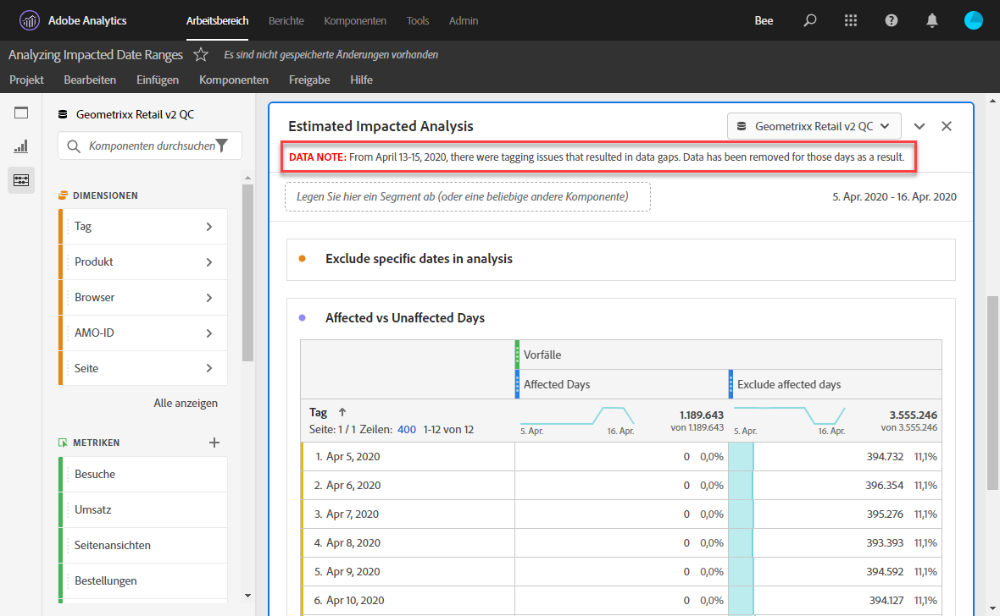
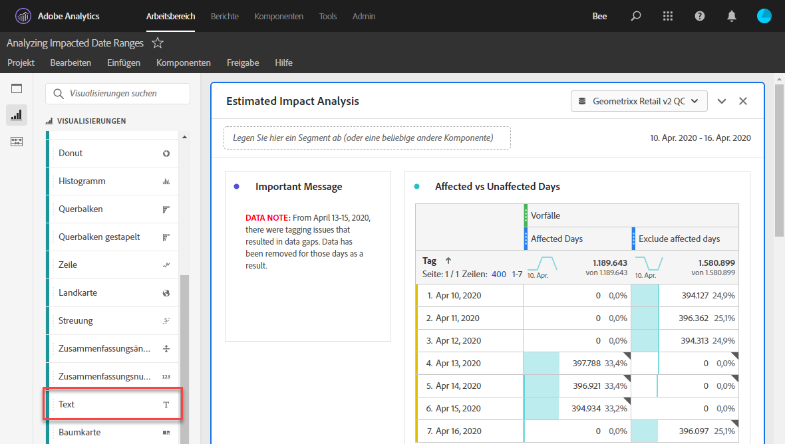
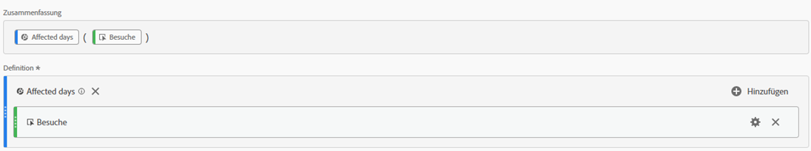
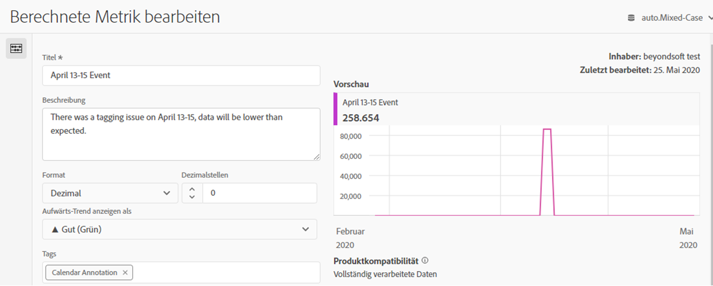
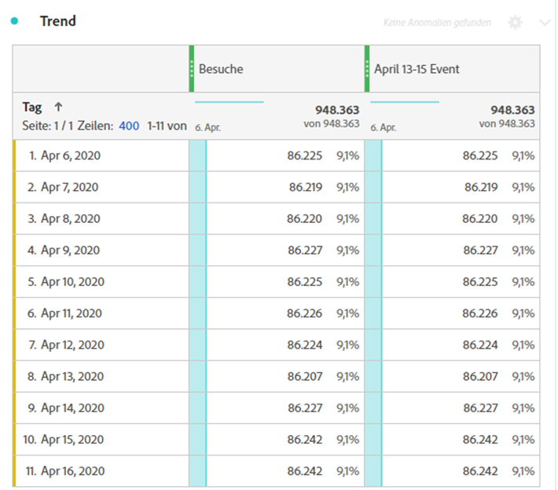
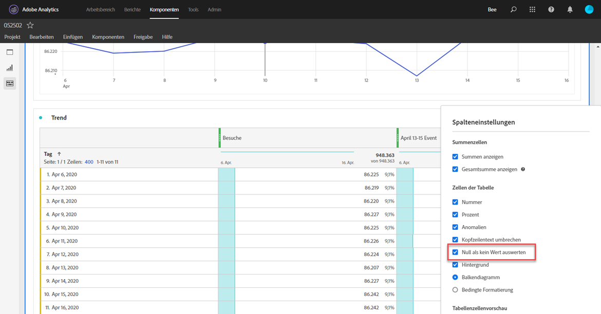
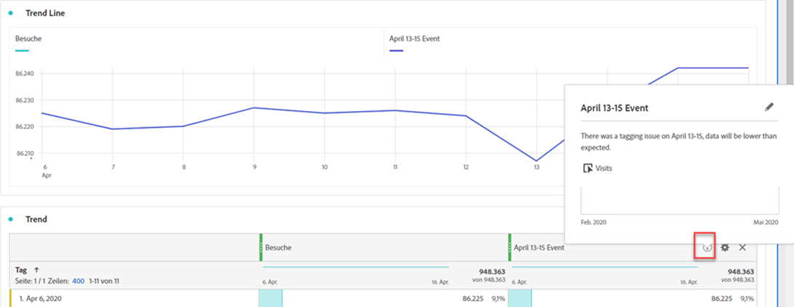

# Kommunizieren der Auswirkungen von Ereignissen an Benutzer

Wenn Sie Daten haben [von einem Ereignis betroffen](overview.md) ist es wichtig, dieses Ereignis den Benutzern in Ihrer Organisation mitzuteilen.

* Entwicklung eines allgemeinen Haftungsausschlusses, der in der Kommunikation verwendet werden kann, um Konsistenz zu gewährleisten
* Fortlaufende Kommunikation mit Analytics-Benutzern und wichtigen Stakeholdern während und nach dem Ereignis
* Erinnern Sie im Kalender an nachfolgende Meilensteine, z. B. im folgenden Monat oder Jahr. Diese Kommunikation in der Zukunft hilft, Benutzende daran zu erinnern, wie sich Berichte in Monats- oder Jahresberichten auswirken.

In Adobe Analytics werden in den folgenden Abschnitten verschiedene Methoden zur Kommunikation mit Benutzenden in Ihrem Unternehmen beschrieben. Sie können auch andere Methoden außerhalb von Adobe Analytics verwenden, z. B. E-Mail, um mit Benutzenden zu kommunizieren.

## Kommunikation über Bedienfeld- oder Visualisierungsbeschreibungen

Wenn Sie ein Workspace-Projekt unter Benutzenden in Ihrem Unternehmen freigegeben haben, können Sie die Auswirkungen eines Ereignisses über Bedienfelder oder Visualisierungsbeschreibungen kommunizieren. Klicken Sie mit der rechten Maustaste auf einen Bereich oder eine Visualisierungskopfzeile und wählen Sie **[!UICONTROL Beschreibung bearbeiten]**.

## Kommunikation über Textvisualisierungen

Sie können die Wirkung eines Ereignisses auch durch spezielle Textvisualisierungen kommunizieren. Siehe [Textvisualisierungen](/help/analyze/analysis-workspace/visualizations/text.md) im Analyze-Benutzerhandbuch.

## Hinzufügen benutzerdefinierter Kalenderereignisse zu Trends in Workspace

Für jede Trend-Visualisierung in Workspace können Sie eine Reihe hinzufügen, die Ihren betroffenen Datumsbereich darstellt.

1. Erstellen Sie eine berechnete Metrik mit dem Segment „Betroffene Tage“, indem Sie dem Befehl [Bestimmte Daten in Analyse ausschließen](segments.md) folgen.
1. Fügen Sie die gewünschte Metrik zur Arbeitsfläche für berechnete Metriken hinzu.

   

1. Fügen Sie einen Titel und eine Beschreibung hinzu, die die Benutzer über die Auswirkungen informiert. Sie können diese Metrik bei Bedarf auch als Kalenderanmerkung taggen .

   

1. Fügen Sie in einer Freiformtabelle die Dimension „Tag“ hinzu. Hinzufügen von „Besuchen“ und Ihrer berechneten Metrik als Spalten nebeneinander.

   

1. Klicken Sie auf das Zahnradsymbol Spalteneinstellungen für Ihre berechnete Metrik und aktivieren Sie **[!UICONTROL Null als keinen Wert interpretieren]**.

   

1. Fügen Sie eine Linienvisualisierung hinzu. Betroffene Tage werden mit einer anderen Farbe dargestellt. Benutzer können auch auf das Symbol „Info“ in der berechneten Metrik klicken, um weitere Informationen zu erhalten.

   

