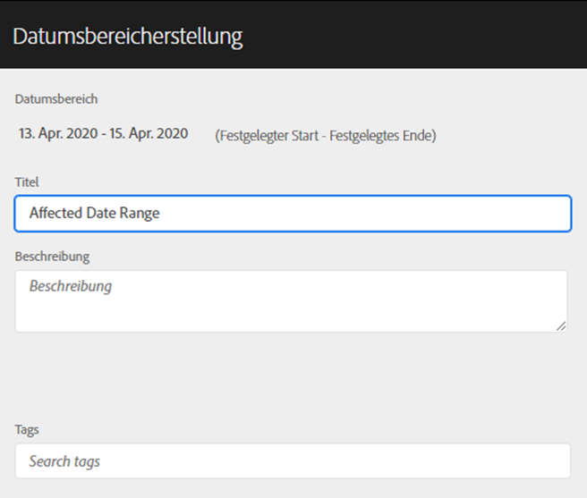
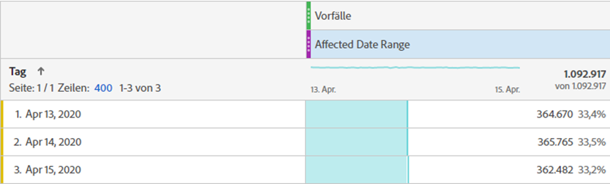
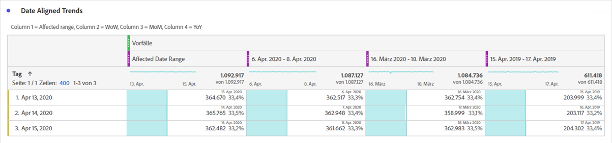
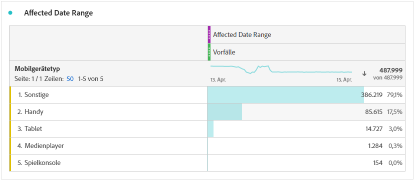
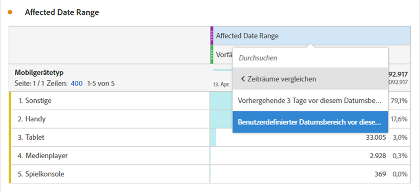
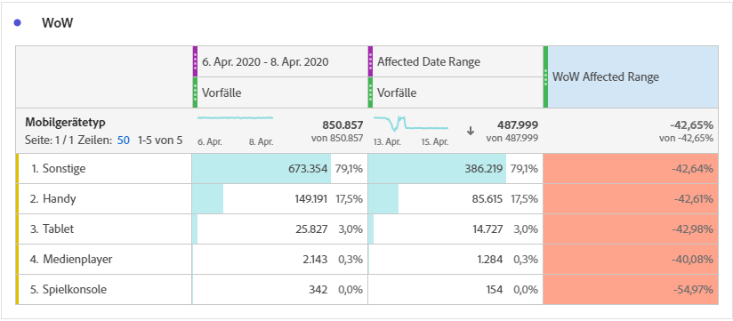
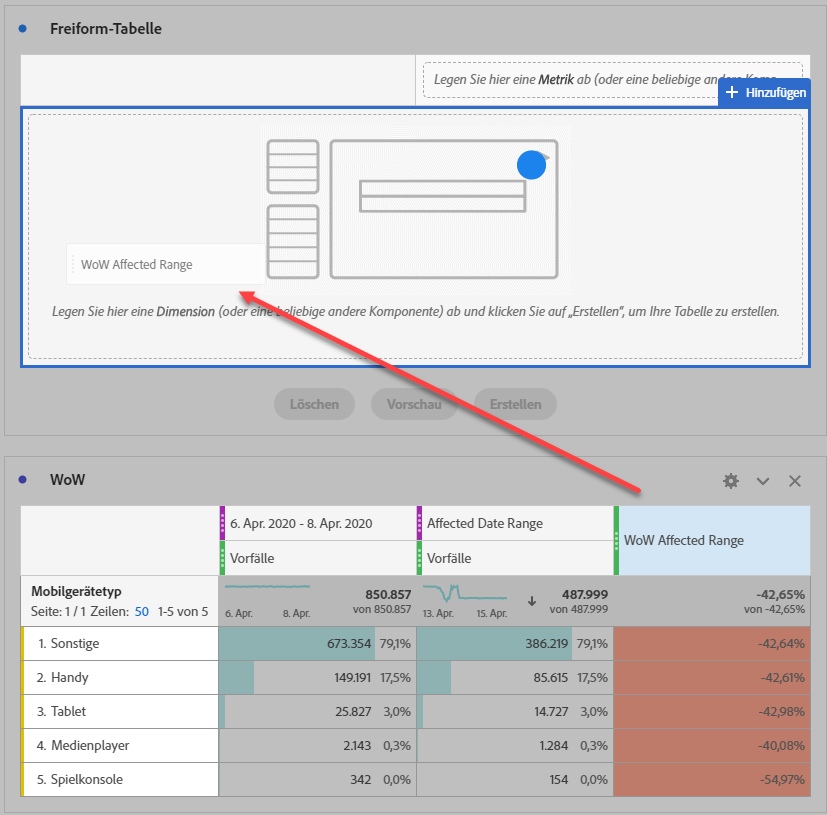
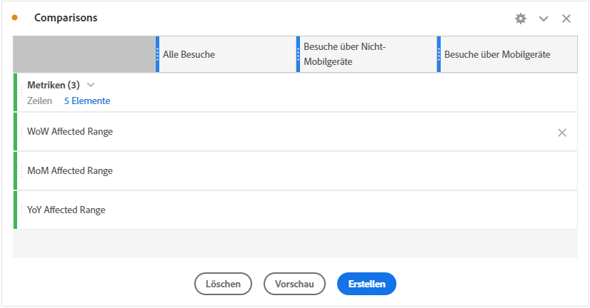
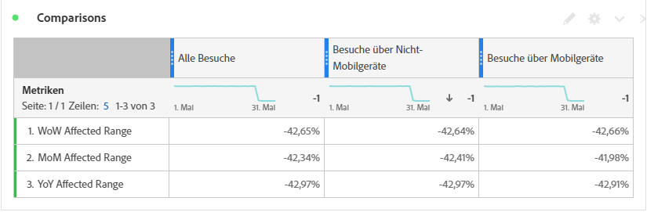

# Vergleichen der von einem Ereignis betroffenen Daten mit vorherigen Datumsbereichen

Wenn Sie Daten haben [betroffen von einem Ereignis](overview.md) können Sie sich historische Trends ansehen, um deren Auswirkungen abzuschätzen. Dieser Vergleich ist nützlich, um zu verstehen, wie stark sich ein Ereignis auf Ihre Daten auswirkt, sodass Sie entscheiden können, ob Sie die Daten ausschließen, einen Hinweis zu Berichten hinzufügen oder sie ignorieren möchten.

## Erstellen eines Datumsbereichs, der das Ereignis enthält

Erstellen Sie einen Datumsbereich, der das Ereignis umfasst, um mit der Untersuchung der Auswirkungen dieses Ereignisses zu beginnen.

1. Navigieren Sie **[!UICONTROL Komponenten]** > **[!UICONTROL Datumsbereiche]**.
2. Klicken Sie auf **[!UICONTROL Hinzufügen]**.
3. Wählen Sie den Datumsbereich aus, in dem das Ereignis aufgetreten ist. Klicken Sie auf **[!UICONTROL Speichern]**.

   

## Ereignisdaten und ähnliche frühere Bereiche nebeneinander anzeigen

Mit einer Freiformtabellen-Visualisierung können Sie jede Metrik zwischen dem Datumsbereich des Ereignisses mit ähnlichen früheren Datumsbereichen vergleichen.

1. Öffnen Sie ein Workspace-Projekt und fügen Sie der Freiformtabelle die Dimension „Tag“ hinzu. Wenden Sie den kürzlich erstellten Datumsbereich an, der in einer Metrik gestapelt ist, z. B. „Vorfälle“.

   

2. Klicken Sie mit der rechten Maustaste auf den Datumsbereich und dann auf **[!UICONTROL Spalte für Zeitraum hinzufügen]** > **[!UICONTROL Benutzerdefinierter Datumsbereich zu diesem Datumsbereich]**.
   * Wählen Sie für einen Vergleich von Woche zu Woche den Bereich des Ereignisses abzüglich 7 Tage aus. Stellen Sie sicher, dass die Wochentage zwischen dem Ereignis und diesem Datumsbereich ausgerichtet sind.
   * Wählen Sie für einen Monat-für-Monat-Vergleich den Bereich des Ereignisses aus dem letzten Monat. Sie können auch den Bereich des Ereignisses abzüglich 28 Tage auswählen, wenn Sie die Wochentage anpassen möchten.
   * Wählen Sie für einen Jahresvergleich den Bereich des Ereignisses aus dem letzten Jahr aus.
3. Wenn Sie den gewünschten Datumsbereich auswählen, werden diese zu Ihrer Freiformtabelle hinzugefügt. Sie können mit der rechten Maustaste klicken und so viele Datumsbereiche hinzufügen, wie Sie vergleichen möchten.

   

## Prozentuale Unterschiede zwischen dem Ereignis und ähnlichen vorherigen Bereichen berechnen

Vergleichen Sie Dimensionselemente zwischen dem Datumsbereich eines Ereignisses und ähnlichen früheren Datumsbereichen mithilfe einer Freiformtabellen-Visualisierung. Diese Schritte veranschaulichen ein Beispiel, das Sie Woche für Woche durchführen können.

1. Öffnen Sie ein Workspace-Projekt und fügen Sie **Freiformtabelle eine** Dimension hinzu. Sie können beispielsweise die Dimension „Mobilgerätetyp“ verwenden. Wenden Sie den kürzlich erstellten Datumsbereich an, der in einer Metrik gestapelt ist, z. B. „Vorfälle“:

   

2. Klicken Sie mit der rechten Maustaste auf den Datumsbereich und dann auf **[!UICONTROL Zeiträume vergleichen]** > **[!UICONTROL Benutzerdefinierter Datumsbereich mit diesem Datumsbereich]**. Wählen Sie den Bereich des Ereignisses abzüglich 7 Tage aus. Stellen Sie sicher, dass die Wochentage zwischen dem Ereignis und diesem Datumsbereich ausgerichtet sind.

   

3. Benennen Sie die daraus resultierende Metrik „prozentuale Änderung“ in etwas Spezifischeres um, z. B. „Von WoW betroffener Bereich“. Klicken Sie auf das Informationssymbol und dann auf den Stift zum Bearbeiten, um den Namen der Metrik zu bearbeiten.

   

4. Wiederholen Sie die Schritte 3 und 4 für Vergleiche von Monat zu Monat und von Jahr zu Jahr. Sie können diese Aktion in derselben Tabelle oder in separaten Tabellen durchführen.

## Vergleichsdatumsbereiche nebeneinander als Zeilen analysieren

Wenn Sie die oben genannten prozentualen Änderungen weiter analysieren möchten, können Sie sie in Zeilen konvertieren.

1. Fügen Sie eine Freiformtabellen-Visualisierung hinzu und aktivieren Sie den Tabellen-Builder. Mit dieser Aktion können Sie die Metriken für die prozentuale Änderung in der gewünschten Reihenfolge platzieren.
2. Halten Sie `Ctrl` (Windows) oder `Cmd` (Mac) gedrückt und ziehen Sie die Metriken mit 3 % Änderung nacheinander in die Zeilen der Tabelle.

   

3. Fügen Sie das Segment „Alle Besuche“ zur Spalte der Tabelle und zu allen anderen gewünschten Segmenten hinzu.

   

4. Klicken Sie **[!UICONTROL Erstellen]**. Aus der resultierenden Tabelle können Sie die betroffenen Bereiche im Vergleich zur vorherigen Woche, zum Monat und zum Jahr in beliebigen Segmenten anzeigen.

   
