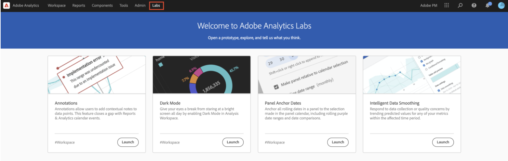
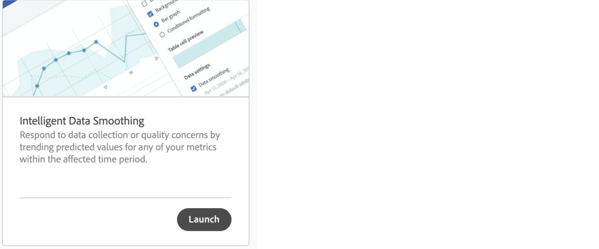
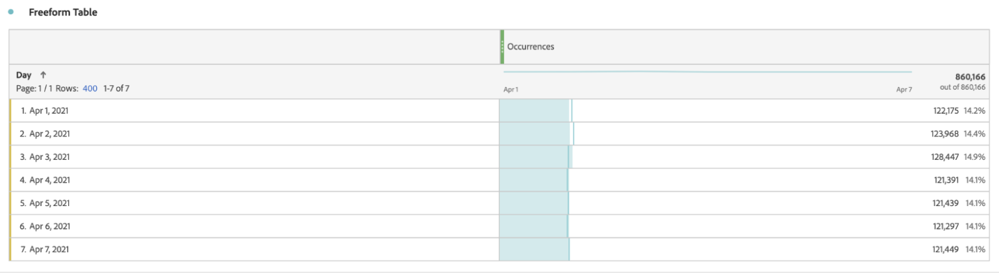
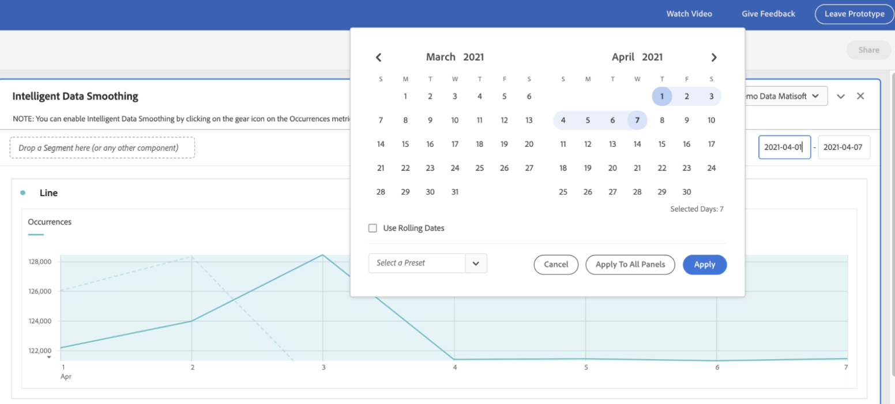
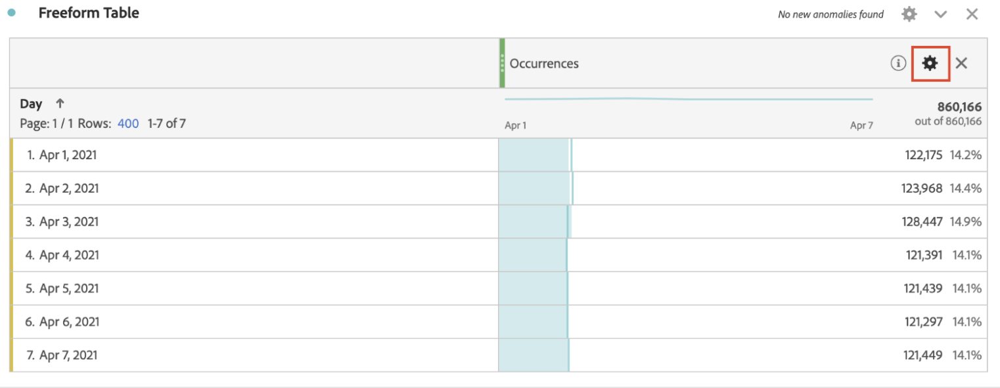
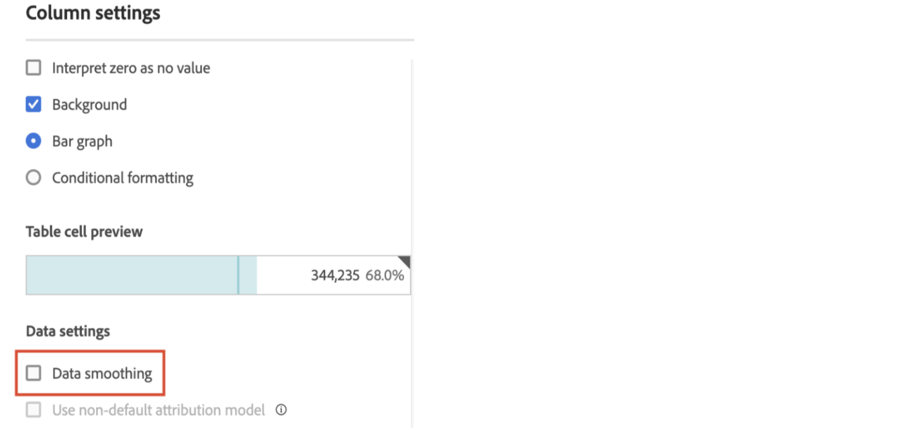
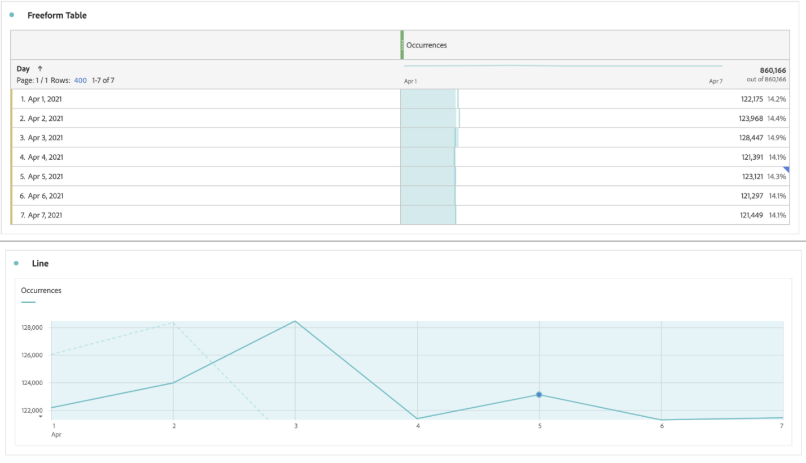

# Intelligente Datenausgleichung

In seltenen Fällen können einige Faktoren die Datenqualität beeinträchtigen. Sowohl Traffic als auch Implementierungsänderungen oder Service-Unterbrechungen können sich auf die Integrität der erfassten Daten auswirken. Sie erschweren auch die Analyse, inwiefern das Ereignis die Vollständigkeit der Daten beeinflusst haben könnte.

Intelligente Datenausgleichung ist ein Prototyp in [Analytics Labs](/help/analyze/labs.md) der dabei helfen kann, diese Ansicht abzuschließen, indem historische Trends analysiert werden, um den Wert einer beliebigen Metrik innerhalb des betroffenen Zeitraums vorherzusagen. Der Prototyp wendet erweiterte Algorithmen des maschinellen Lernens an, um die erwarteten Werte für Metriken über den analysierten Zeitraum darzustellen.

## Intelligente Datenausgleichung ausführen

1. Navigieren Sie zu Adobe Analytics Labs:
   
1. Starten Sie den Prototyp Intelligente Datenausgleichung .
   
1. Fügen Sie die Metrik, die analysiert werden muss, zur Freiformtabelle hinzu. Der Prototyp funktioniert nur mit einer täglichen Granularität. Stellen Sie daher sicher, dass die Dimension in der Tabelle Tag lautet.
   
1. Wählen Sie einen Datumsbereich aus, der breiter ist als das Fenster des Ereignisses, stellen Sie jedoch sicher, dass er das Ereignis enthält.
   
1. Klicken Sie in der Freiformtabelle auf das Zahnradsymbol für die Metrik.
   
1. Wählen [!UICONTROL  unter ] die Option [!UICONTROL Datenausgleichung] aus.
   
1. Wählen Sie das Datum/den Datumsbereich für das Ereignis aus und klicken Sie auf [!UICONTROL Anwenden].
Stellen Sie sicher, dass der Datenbereich für die Datenausgleichung eine Teilmenge des für das Bedienfeld ausgewählten Datumsbereichs ist. Die Metriken in der Tabelle und im Diagramm werden durch die prognostizierten Werte ersetzt.
   
