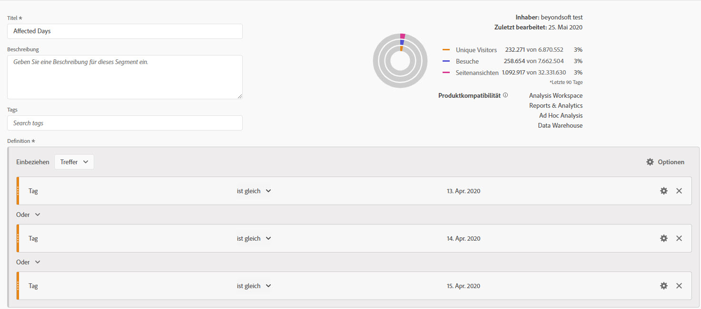
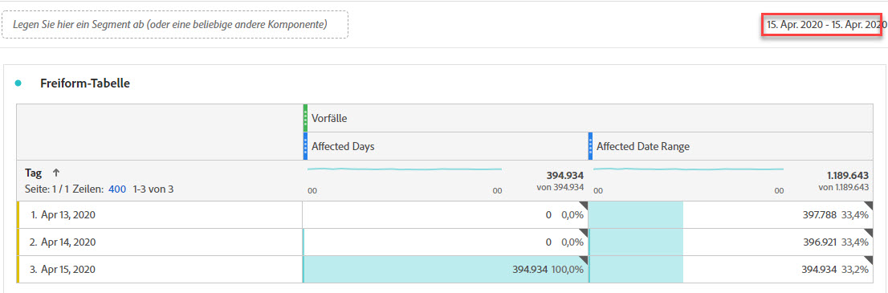
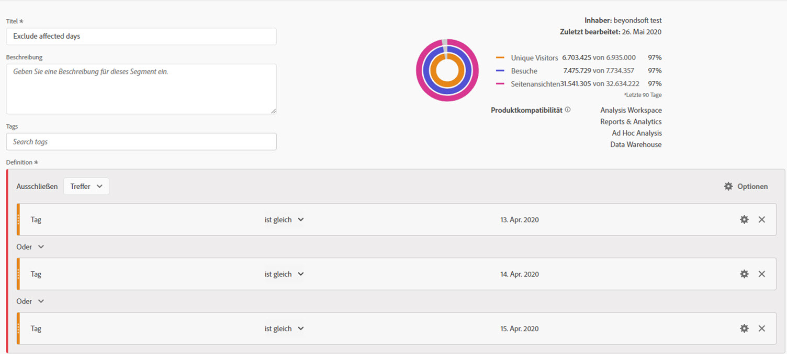
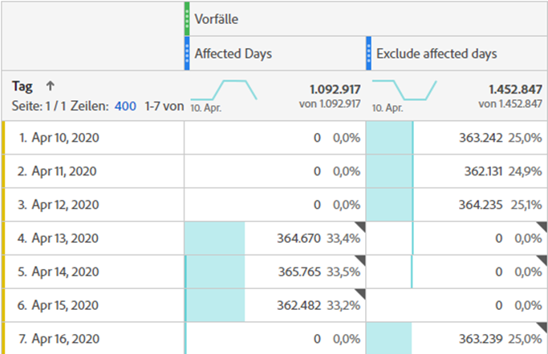
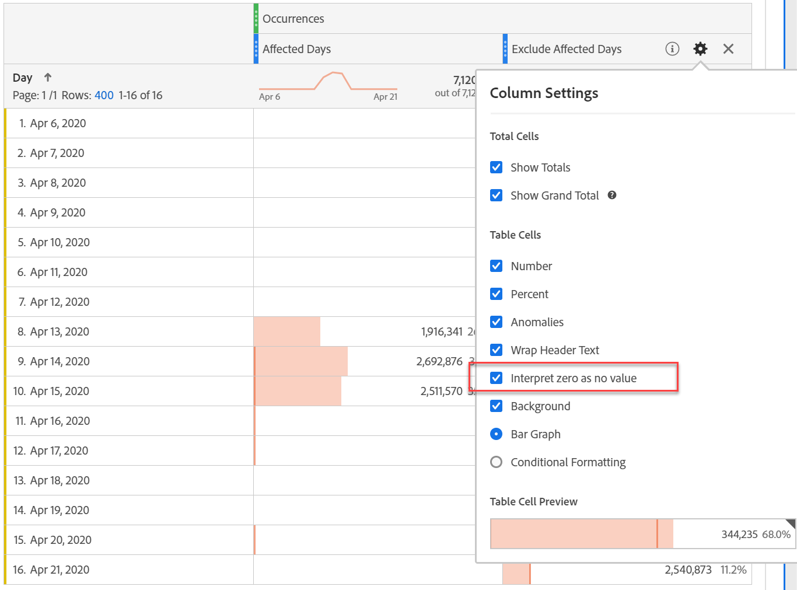
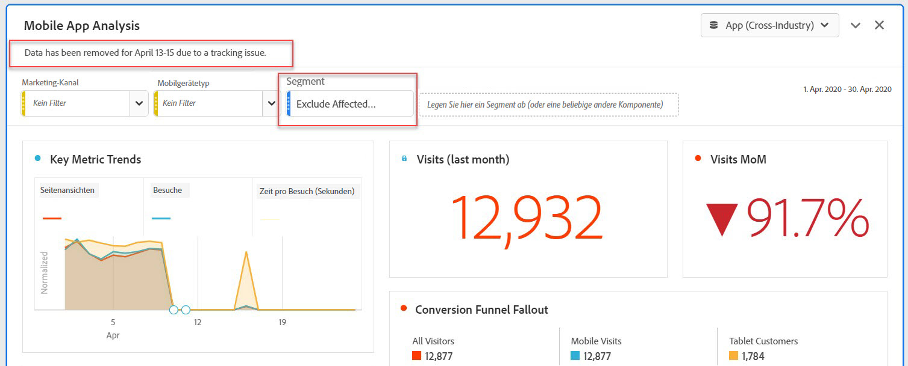
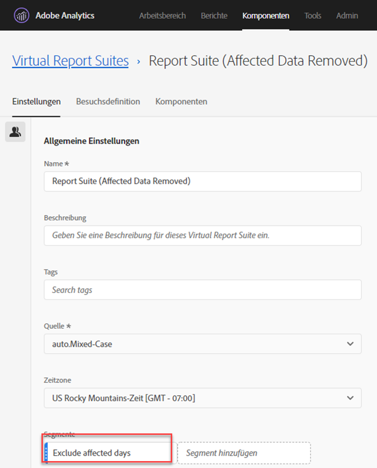

# Ausschließen spezifischer Daten in der Analyse

Wenn Sie Daten haben [von einem Ereignis betroffen](overview.md) können Sie ein Segment verwenden, um alle Datumsbereiche auszuschließen, die Sie nicht in Ihre Berichte aufnehmen möchten. Die Segmentierung ereignisbetroffener Daten kann dazu beitragen, dass Ihr Unternehmen keine Entscheidungen über partielle Daten trifft.

## Betroffene Tage isolieren {#isolate}

Erstellen Sie ein Segment, das den betroffenen Tag oder Datumsbereich isoliert. Dieses Segment ist nützlich, wenn Sie sich nur auf die Problemtage konzentrieren möchten, um mehr Informationen über die Auswirkungen zu sehen.

1. Öffnen Sie Segment Builder, indem Sie zu **[!UICONTROL Komponenten]** > **[!UICONTROL Segmente]** wechseln und dann auf **[!UICONTROL Hinzufügen]** klicken.
2. Ziehen Sie die Dimension „Tag“ auf die Arbeitsfläche „Definition“ und legen Sie sie auf den Tag fest, den Sie isolieren möchten.
3. Wiederholen Sie die obigen Schritte für jeden Tag, den Sie in Ihrem Bericht isolieren möchten.

>[!TIP]
>
>Um die OR-Anweisung in eine AND-Anweisung zu ändern, klicken Sie auf den Abwärtspfeil neben ODER und wählen Sie AND aus.

Adobe empfiehlt, die orangefarbenen Dimensionskomponenten und nicht die lilafarbenen Datumsbereichskomponenten zu verwenden. Wenn Sie lilafarbene Datumsbereichskomponenten verwenden, wird der Kalenderbereich des Projekts überschrieben:

## Betroffene Tage ausschließen {#exclude}

Erstellen Sie ein Segment, das den betroffenen Tag oder Datumsbereich ausschließt. Dieses Segment ist nützlich, wenn Sie die Tage ausschließen möchten, an denen Probleme aufgetreten sind, um die Auswirkungen auf das gesamte Reporting zu minimieren.

1. Öffnen Sie Segment Builder, indem Sie zu **[!UICONTROL Komponenten]** > **[!UICONTROL Segmente]** wechseln und dann auf **[!UICONTROL Hinzufügen]** klicken.
2. Klicken Sie oben rechts auf der Arbeitsfläche für Segmentdefinitionen auf **[!UICONTROL Optionen]** > **[!UICONTROL Ausschließen]**.
3. Ziehen Sie die Dimension „Tag“ auf die Arbeitsfläche „Definition“ und legen Sie sie auf den Tag fest, den Sie entfernen möchten.
4. Wiederholen Sie die obigen Schritte für jeden Tag, den Sie aus Ihrem Bericht entfernen möchten.

## Diese Segmente in Berichten verwenden

Nachdem Sie das Ausschlusssegment erstellt haben, können Sie es genau so verwenden, wie Sie andere Segmente verwenden würden.

### Vergleichen von Segmenten in einem Trend-Bericht {#compare}

Sie können sowohl das Segment „Betroffene Tage“ als auch das Segment „Betroffene Tage ausschließen“ in einem Bericht anwenden, um sie nebeneinander zu vergleichen. Ziehen Sie beide Segmente über oder unter eine Metrik, um sie zu vergleichen:

Wenn Sie in Ihrer Tabelle oder Ihren Visualisierungen keine Nullen anzeigen möchten (was zu Leistungseinbußen führt), aktivieren Sie unter **[!UICONTROL die Option „Null als]** interpretieren“.

Wenn Sie in Ihrer Tabelle oder Ihren Visualisierungen keine Nullen anzeigen möchten (was zu Leistungseinbußen führt), aktivieren Sie unter **[!UICONTROL die Option „Null als]** interpretieren“.

### Anwenden des Ausschlusssegments auf ein Projekt {#apply}

Sie können das Segment „Betroffene Tage ausschließen“ auf ein Workspace-Projekt anwenden. Ziehen Sie das Ausschlusssegment in den Abschnitt Workspace-Arbeitsfläche mit der Bezeichnung *Legen Sie hier ein Segment ab*.

>[!TIP]
>
>Geben Sie in der Beschreibung des Bedienfelds einen Hinweis zu ausgeschlossenen Daten, um die Betrachter des Berichts zu unterstützen. Klicken Sie mit der rechten Maustaste auf den Titel eines Bedienfelds und dann auf **[!UICONTROL Beschreibung bearbeiten]**.

### Verwenden des Ausschlusssegments in einer Virtual Report Suite {#use-vrs}

Sie können das Segment in einer [Virtual Report Suite](/help/components/vrs/vrs-about.md) verwenden, um Daten bequemer auszuschließen. Diese Option eignet sich optimal, da Sie nicht daran denken müssen, das Segment für jeden Bericht anzuwenden, der den betroffenen Datumsbereich enthält. Wenn Sie Virtual Report Suites bereits als primäre Datenquelle verwenden, können Sie das Segment zu einer vorhandenen Virtual Report Suites hinzufügen.

1. Navigieren Sie zu **[!UICONTROL Komponenten]** > **[!UICONTROL Virtual Report Suites]**.
2. Klicken Sie auf **[!UICONTROL Hinzufügen]**.
3. Geben Sie den gewünschten Namen und die Beschreibung für die Virtual Report Suite ein.
4. Ziehen Sie das Ausschlusssegment in den Bereich mit der Bezeichnung **[!UICONTROL Segment hinzufügen]**.
5. Klicken **[!UICONTROL oben]** auf „Weiter“ und dann auf **[!UICONTROL Speichern]**.

