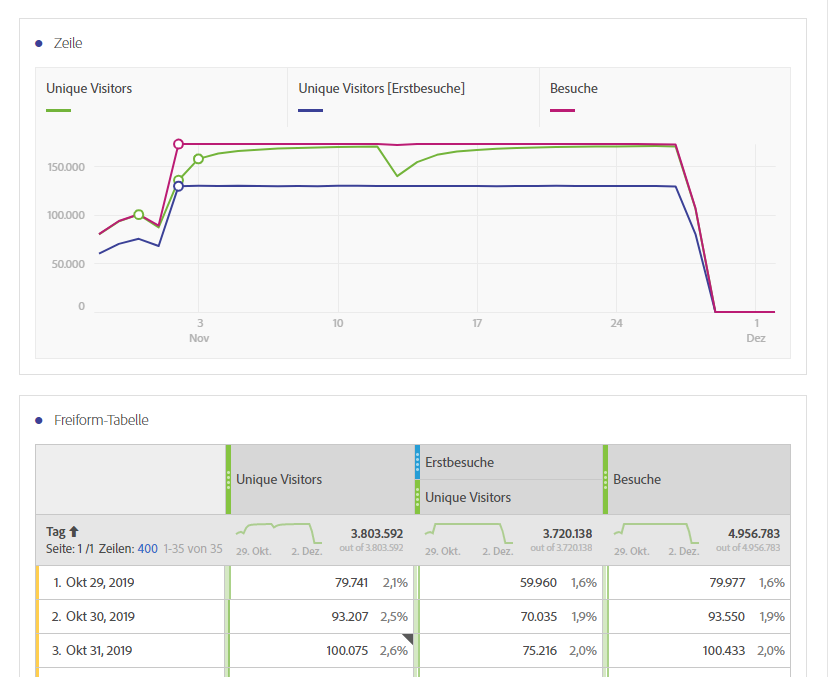

# Übersetzungshandbuch für häufig verwendete Metriken anderer Plattformen

Auf anderen Plattformen wie Google Analytics verwenden viele Berichte eine Reihe gemeinsamer Metriken. Auf dieser Seite erfahren Sie, wie Sie die in vielen Berichten verwendeten Metriken nachbilden.

Um einer Freiformtabelle im Arbeitsbereich mehrere Metriken hinzuzufügen, ziehen Sie die Metrik aus dem Komponentenbereich neben der Metrikkopfzeile im Arbeitsbereich:

## Akquise-Metriken

**Nutzer** ähnelt ungefähr **Unique Visitors** in Workspace. Weitere Informationen finden Sie im Abschnitt zur Dimension [Unique Visitors](/help/components/metrics/unique-visitors.md) im Benutzerhandbuch zu Komponenten.

**Neue Nutzer** erhalten Sie wie folgt:

1. Ziehen Sie die Metrik **Unique Visitors** in den Arbeitsbereich.
2. Ziehen Sie das Segment **Erstbesuche** über die Kopfzeilen der Metrik „Unique Visitors“:

   

**Sitzungen** entsprechen ungefähr den **Besuchen** in Analysis Workspace. Weitere Informationen finden Sie im Abschnitt zur Dimension [Besuche](/help/components/metrics/visits.md) im Benutzerhandbuch zu Komponenten.

## Verhaltensmetriken

Die **Absprungrate** steht in Analysis Workspace als Metrik zur Verfügung. Weitere Informationen finden Sie im Abschnitt zur Metrik [Absprungrate](/help/components/metrics/bounce-rate.md) im Benutzerhandbuch zu Komponenten.

**Seiten/Sitzung** ist eine berechnete Metrik. Sie erhalten sie wie folgt:

1. Wenn Sie diese berechnete Metrik bereits erstellt haben, suchen Sie sie unter „Metriken“ und ziehen Sie sie in den Arbeitsbereich.
2. Wenn Sie diese berechnete Metrik noch nicht erstellt haben, klicken Sie auf das Symbol **+** neben der Metrikliste, um den Builder für berechnete Metriken zu öffnen.
3. Geben Sie den Titel „Seitenansichten pro Besuch“ und ggf. eine Beschreibung ein.
4. Legen Sie das Format auf „Dezimal“ fest und setzen Sie die Anzahl der Dezimalstellen auf 2.
5. Ziehen Sie die Metriken **Seitenansichten** und **Besuche** in den Definitionsbereich.
6. Ordnen Sie die Definition so an, dass die Formel **Seitenansichten dividiert durch Besuche** lautet.

   

7. Klicken Sie auf „Speichern“, um zu Ihrem Arbeitsbereich zurückzukehren.
8. Ziehen Sie die neu definierte berechnete Metrik in den Arbeitsbereich.

   Weitere Informationen zu [berechneten Metriken](/help/components/c-calcmetrics/cm-overview.md) finden Sie im Benutzerhandbuch zu Komponenten.

**Durchschnittl. Sitzungsdauer** entspricht ungefähr der **Zeit pro Besuch (Sekunden)**. Weitere Informationen zu den Metriken [Besuchszeit pro Besuch](/help/components/metrics/time-spent-per-visit.md) finden Sie im Komponenten-Benutzerhandbuch.

## Konversionsmetriken

**Zielvorhaben-Conversion-Rate**, **Zielvorhabenabschlüsse** und **Zielvorhabenwert** erfordern eine zusätzliche Implementierung auf beiden Plattformen. Wenn Ihre Implementierung bereits die Produktdimension und das Kaufereignis berücksichtigt, sollten Sie die folgenden Schritte beachten:

1. Ziehen Sie die Metriken **Bestellungen**, **Umsatz** und **Besuche** in den Arbeitsbereich.
1. Erstellen Sie eine berechnete Metrik aus **Bestellungen pro Besuch**. Halten Sie die Strg- (Windows) oder Befehlstaste (Mac) gedrückt und klicken Sie auf beide Metrikkopfzeilen, um sie zu markieren. Klicken Sie mit der rechten Maustaste auf eine der Kopfzeilen, wählen Sie **Metrik aus Auswahl erstellen** und klicken Sie dann auf **$1**. Diese neue Metrik ähnelt der Zielvorhaben-Conversion-Rate.
1. Falls Dezimalstellen erforderlich sind, bearbeiten Sie die berechnete Metrik. Klicken Sie auf die Info-Schaltfläche in der Metrikkopfzeile und dann auf das Stiftsymbol. Fügen Sie im Fenster des Builders für berechnete Metriken eine oder zwei Dezimalstellen hinzu und klicken Sie dann auf „Speichern“.

   

Wenn Ihre Implementierung noch keine Produkt- oder Konversionsdaten enthält, empfiehlt Adobe, mit einem Implementierungsberater zusammenzuarbeiten, um die Datenqualität und -integrität sicherzustellen.
