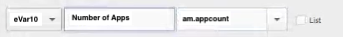
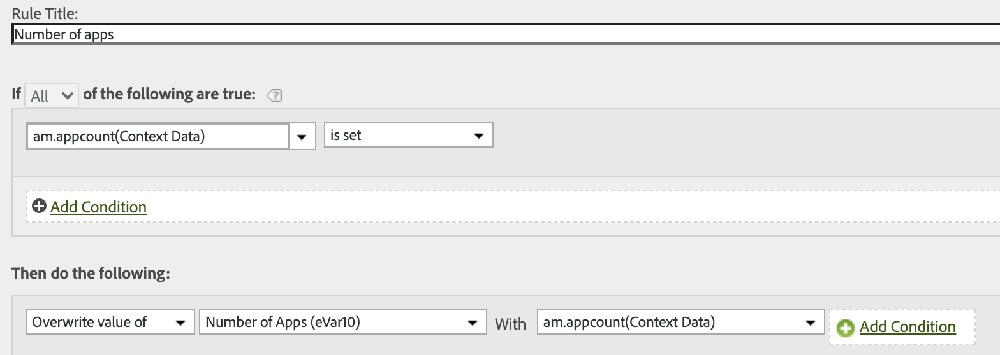
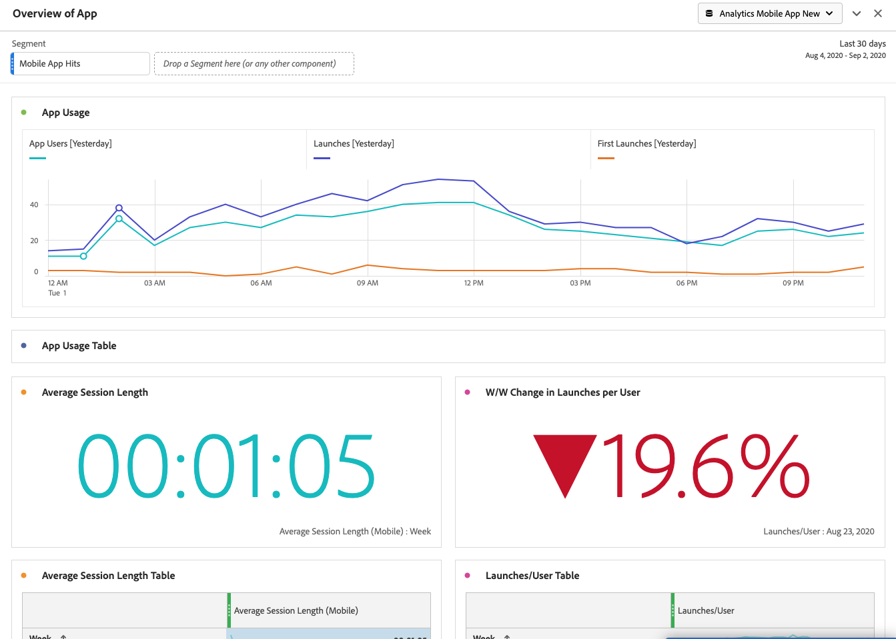

# Migrieren von Verarbeitungsregeln für Mobile Services nach Adobe Analytics

In diesem Dokument erhalten Sie Anweisungen zum Migrieren zusätzlicher Verarbeitungsregeln (über Lebenszyklusmetriken hinaus), die Sie in der Mobile Services-Benutzeroberfläche erstellt haben, nach Adobe Analytics.

Verarbeitungsregeln werden verwendet, um Werte von Kontextdatenvariablen in props und eVars zu verschieben. Sie können beispielweise den Wert einer „search-term“-Kontextdatenvariablen in den Wert einer „eVar“-Verkaufsvariablen einfügen und anschließend diesen Wert bei jedem Treffer überschreiben. Ohne Verarbeitungsregeln sind Kontextdatenvariablen bedeutungslos und füllen keine Berichte in Analytics aus.

Dieses Dokument zeigt Ihnen auch, wie Sie Berichte zur Mobile-Nutzung in Analysis Workspace durchführen.

## Verarbeitungsregeln migrieren

Wenn Sie Mobile Services für zusätzliche Funktionen wie Verarbeitungsregeln und Nutzungsberichte verwenden, können Sie zur Ausführung dieser Funktionen nahtlos zur Analytics-Benutzeroberfläche (Benutzeroberfläche für Verarbeitungsregeln oder Analysis Workspace) wechseln. Für Lebenszyklusmetriken oder Regeln, die in der Benutzeroberfläche für Verarbeitungsregeln von Adobe Analytics eingerichtet wurden, müssen Sie keine Migration durchführen. Lebenszyklusmetriken sind vorkonfigurierte Metriken, die automatisch erfasst werden, wenn das Mobile SDK zum ersten Mal in Ihrer Mobile App implementiert wird.

Wenn Sie jedoch zusätzliche Verarbeitungsregeln in der Mobile Services-Benutzeroberfläche (über Lebenszyklusmetriken hinaus) einrichten, sollten Sie diese migrieren, damit Sie sie in Analytics bearbeiten bzw. löschen können, nachdem Sie den Zugriff auf Mobile Services verloren haben.

1. Melden Sie sich bei `experience.adobe.com` an und gehen Sie zu Mobile Services.
1. Klicken Sie auf das Zahnradsymbol einer Mobile App, deren Kontextvariablenzuordnungen Sie nach Adobe Analytics migrieren möchten.
1. Klicken Sie auf den Menüeintrag **[!UICONTROL Variablen und Metriken verwalten]** und anschließend auf die Registerkarte **[!UICONTROL Benutzerdefinierte Variablen]**. Hier können Sie sehen, welche Kontextvariablenzuordnungen (Kontextdaten) zur Konfiguration hinzugefügt wurden. Notieren Sie sich diese Konfigurationen (oder machen Sie einen Screenshot). Beispiel:

   

1. Wechseln Sie in Experience Cloud zu Adobe Analytics und stellen Sie sicher, dass Sie sich in derselben mobilen Report Suite befinden, die Sie auch in Mobile Services angezeigt haben.
1. Wechseln Sie zu **[!UICONTROL Admin]** > **[!UICONTROL Report Suites]** > **[!UICONTROL Einstellungen bearbeiten]** > **[!UICONTROL Allgemein]** > **[!UICONTROL Verarbeitungsregeln]**.
1. Klicken Sie auf **[!UICONTROL Regel hinzufügen]**.
1. Ignorieren Sie die Bedingungen und fügen Sie die gleichen Kontextvariablen hinzu, die in Mobile Services vorhanden sind.

   

1. Klicken Sie auf **[!UICONTROL Speichern]**.

## Berichte zur Mobile-Nutzung in Analysis Workspace

Zusätzlich zu den Metriken und Dimensionen zur Mobile-Nutzung (sofern die Report Suite für Mobile Services aktiviert ist) enthält Analysis Workspace mehrere Mobile-Projektvorlagen, die die Analyse erleichtern können:

* **[!UICONTROL Messaging]**: Mit Augenmerk auf die Leistung von In-App- und Push-Nachrichten.
* **[!UICONTROL Standort]**: Beinhaltet eine Karte zur Anzeige von Standortdaten.
* **[!UICONTROL Schlüsselmetriken]**: Sehen Sie sich die wichtigsten Metriken Ihrer Mobile App genauer an.
* **[!UICONTROL App-Nutzung]**: Wie viele Benutzer, Starts und erste Starts hat die Mobile App verzeichnet und wie lange dauerte eine durchschnittliche Sitzung?
* **[!UICONTROL Akquise]**: Wie funktionieren mobile Akquise-Links?
* **[!UICONTROL Leistung]**: Welche Leistung erzielt die Mobile App und wo haben Benutzer Probleme?
* **[!UICONTROL Bindungsgrad]**: Wer sind meine treuen Benutzer und was tun sie?
* **[!UICONTROL Journeys]**: Welche markanten Verwendungsmuster weist meine Mobile App auf?

Im Folgenden finden Sie einen Ausschnitt der Vorlage „Mobile App Usage“:

So greifen Sie auf die Vorlagen zu:

1. Melden Sie sich bei `experience.adobe.com` an, und wählen Sie Analytics aus.
1. Vergewissern Sie sich, dass Sie sich in einer Report Suite befinden, die für Mobile Services aktiviert ist.
1. Klicken Sie auf die Registerkarte **[!UICONTROL Workspace]**.
1. Klicken Sie auf **[!UICONTROL Neues Projekt erstellen]**.
1. Wählen Sie eine der Mobile-Vorlagen aus und klicken Sie auf **[!UICONTROL Erstellen]**.

## Andere Mobile Services-Funktionen migrieren

Die folgenden Mobile Services-Funktionen sind auch mit Adobe Analytics verbunden, setzen jedoch den Erwerb einer Adobe Analytics-SKU voraus:

* Akquise-Links
* Push-Nachrichten
* In-App-Nachrichten
* Verwaltung von Standort-Anlaufpunkten

Wenn Sie Mobile Services für gebührenpflichtige Funktionen nutzen, haben Sie keinen tragfähigen Migrationspfad zu anderen internen/externen Tools:

* Für Akquise-Links können wir Sie zu Adobe-Partnern weiterleiten, um Ihren Bedarf zu decken.
* Push-Nachrichten und In-App-Nachrichten sind in Adobe Campaign Standard und Adobe Campaign Classic (nur Push) verfügbar. Der für die Zielgruppenbestimmung verwendete Datensatz ist jedoch anders. Wir empfehlen Ihnen, mit Ihrem Adobe-Account-Team zusammenzuarbeiten, um Migrationsoptionen für Nachrichtendaten zu ermitteln.
* Für die Standort-Funktionen sollten Sie den neuen [Adobe Experience Platform Location Service](https://www.adobe.com/de/experience-platform/location-service.html) anwenden, der für alle Adobe Experience Platform-Kunden kostenlos ist.
